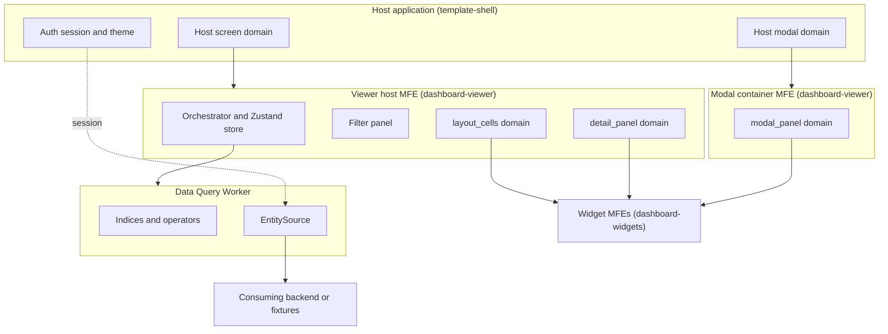
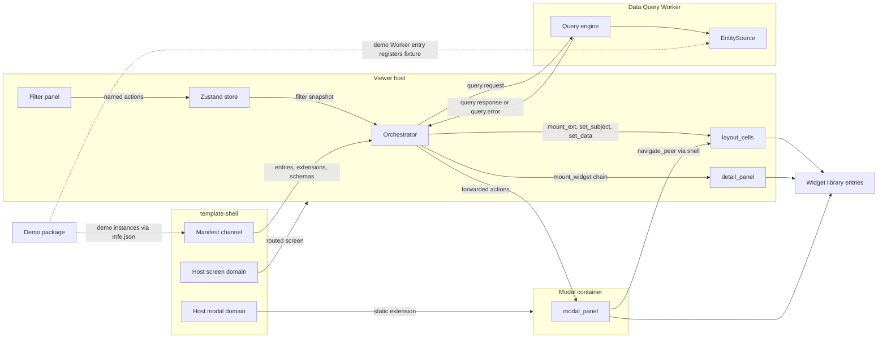

# Technical Design — FrontX Dashboard Template

This design describes how `template-dashboard` ports the DevExpert dashboard viewer onto FrontX: the GTS type catalog, the Viewer host and its Data Query Worker, the widget library, the modal container, the host contract with `template-shell`, the main runtime sequences, and the budgets.

- [ ] `p1` - **ID**: `cpt-frontx-dashboard-design-dashboard-template`

<!-- toc -->

- [1. Architecture Overview](#1-architecture-overview)
  - [1.1 Architectural Vision](#11-architectural-vision)
  - [1.2 Architecture Drivers](#12-architecture-drivers)
  - [1.3 Architecture Layers](#13-architecture-layers)
- [2. Principles & Constraints](#2-principles--constraints)
  - [2.1 Design Principles](#21-design-principles)
  - [2.2 Constraints](#22-constraints)
- [3. Technical Architecture](#3-technical-architecture)
  - [3.1 Domain Model](#31-domain-model)
  - [3.2 Component Model](#32-component-model)
  - [3.3 API Contracts](#33-api-contracts)
  - [3.4 Internal Dependencies](#34-internal-dependencies)
  - [3.5 External Dependencies](#35-external-dependencies)
  - [3.6 Interactions & Sequences](#36-interactions--sequences)
  - [3.7 Database schemas & tables](#37-database-schemas--tables)
  - [3.8 Deployment Topology](#38-deployment-topology)
  - [3.9 Budgets and NFR Realisation](#39-budgets-and-nfr-realisation)
- [4. Additional context](#4-additional-context)
- [5. Traceability](#5-traceability)

<!-- /toc -->

## 1. Architecture Overview

### 1.1 Architectural Vision

`template-dashboard` is a simple port of the viewer half of the DevExpert report-dashboard prototype onto FrontX. A dashboard is data: a dashboard instance names a layout, a theme, and a default time window, and every layout cell carries a widget instance that names the query behind it. The template reads that data and renders it. It adds no authoring, no generation pipeline, and no server component.

The architecture has one orchestrator. The **Viewer host** is a nested-host MFE (micro-frontend: an independently built and mounted UI unit) that the host application mounts as a routed screen. It owns the filter state, the query lifecycle, and the mounting of widgets. A **Data Query Worker** (a browser Web Worker) loads entity collections through the pluggable `EntitySource` contract, indexes them in the browser, and answers typed queries. Widgets are passive MFEs from one widget library. They receive their placement configuration with `set_subject` and their data with `set_data`, and they never touch filters or the Worker.

Modal drill-down reuses the host's own modal domain. That domain gives its occupants no custom actions, so the template ships a static **modal container**. The container occupies the host modal domain and hosts the drill-down widgets in its own inner domain. The Viewer host reaches those widgets through FrontX forwarding across nested hosts. The host must render its modal domain through a domain slot with modal chrome, focus trap, and dismissal; current `template-shell` does not do this yet, so it is a prerequisite shell change tracked outside the template (section 3.5). Everything that is internal in the prototype stays internal here, and every FrontX-specific change is the smallest one that the FrontX rules (isolation, occupancy, forwarding) force.

### 1.2 Architecture Drivers

The drivers are the PRD requirements and the template's sixteen ADRs. Each table below maps a driver to the design element that answers it.

**ADRs**: `cpt-frontx-dashboard-adr-frontend-framework`, `cpt-frontx-dashboard-adr-dashboard-layout-grid`, `cpt-frontx-dashboard-adr-shared-data-types-and-schemas`, `cpt-frontx-dashboard-adr-charting-library`, `cpt-frontx-dashboard-adr-data-grid-library`, `cpt-frontx-dashboard-adr-viewer-state-management`, `cpt-frontx-dashboard-adr-viewer-data-query-layer`, `cpt-frontx-dashboard-adr-theme-distribution`, `cpt-frontx-dashboard-adr-derived-analytics-producer`, `cpt-frontx-dashboard-adr-extension-domain-taxonomy`, `cpt-frontx-dashboard-adr-widget-kind-and-mfe-realization`, `cpt-frontx-dashboard-adr-subject-agnostic-widget-catalog`, `cpt-frontx-dashboard-adr-query-operator-cel`, `cpt-frontx-dashboard-adr-viewer-host-query-lifecycle`, `cpt-frontx-dashboard-adr-live-entity-source`, `cpt-frontx-dashboard-adr-template-packaging-host-contract`

#### Functional Drivers

| Requirement | Design Response |
|-------------|------------------|
| `cpt-frontx-dashboard-fr-overlay-install` | The template is an add-only overlay with its own manifest and three packages under exclusive subtrees; its code resolves host identifiers from `template-shell` constants and it changes no shell file; it requires a rendered modal-domain slot from the host (`cpt-frontx-dashboard-topology-overlay-packages`, `cpt-frontx-dashboard-constraint-shell-only-dependency`). |
| `cpt-frontx-dashboard-fr-demo-opt-in` | `dashboard-demo` is marked `templateExample: true` and holds every `gts.frontx.demo.*` instance, the fixture `EntitySource`, and the demo Worker entry that registers it; it registers its instances through its own `mfe.json` (`cpt-frontx-dashboard-component-demo-package`). |
| `cpt-frontx-dashboard-fr-viewer-host` | The Viewer host is a routed extension in the host screen domain; the route carries the dashboard instance; each open dashboard gets its own store and Worker (`cpt-frontx-dashboard-component-viewer-host`). |
| `cpt-frontx-dashboard-fr-entity-source` | The Worker loads the union of the queries' `input_entity_types` for the time window through the TS-internal `EntitySource.load` of the implementation selected by key; the HTTP implementation (key `http`, same-origin cookie session) ships with the viewer (`cpt-frontx-dashboard-component-entity-source`). |
| `cpt-frontx-dashboard-fr-time-window-reload` | Only a global time-window change triggers a reload and a full re-query; other filter changes run in memory (`cpt-frontx-dashboard-seq-time-window-reload`, `cpt-frontx-dashboard-seq-filter-change`). |
| `cpt-frontx-dashboard-fr-loading-error-states` | Per-cell skeletons during the first load, a dashboard banner with Retry for `entity_fetch_failed`, and a non-blocking reloading indicator (`cpt-frontx-dashboard-seq-failure-handling`). |
| `cpt-frontx-dashboard-fr-fixture-source` | The fixture implementation honors the time window, waits a configurable delay (400 ms by default), and fails on `?demoFail=entities` in development builds (`cpt-frontx-dashboard-component-entity-source`). |
| `cpt-frontx-dashboard-fr-widget-catalog` | One widget-library package ships one `mf_manifest` and 13 MFE entries, one per subject-agnostic kind, each with `realizes:` (`cpt-frontx-dashboard-component-widget-library`). |
| `cpt-frontx-dashboard-fr-filter-panel` | The filter panel renders the time window, the time-range field, and the union of the dashboard queries' `filter_scopes`, and writes to the Viewer host store (`cpt-frontx-dashboard-component-filter-panel`). |
| `cpt-frontx-dashboard-fr-filter-options` | Multiselect options come from the Worker's TS-internal `enumerate_options` over the loaded collections (`cpt-frontx-dashboard-interface-worker-messages`). |
| `cpt-frontx-dashboard-fr-drilldown-panel` | `mount_widget` on `detail_panel` runs the chain unmount, mount, `set_subject`, `set_data`; the Viewer host keeps zero or one panel (`cpt-frontx-dashboard-seq-detail-panel-drilldown`). |
| `cpt-frontx-dashboard-fr-drilldown-modal` | The static modal container occupies the host modal domain and hosts the widgets in its `modal_panel` domain; query errors reach the widget slot (`cpt-frontx-dashboard-component-modal-container`, `cpt-frontx-dashboard-seq-modal-drilldown-open`). |
| `cpt-frontx-dashboard-fr-peer-navigation` | Prev and Next in the container send `navigate_peer` to the origin cell through upward escalation and downward forwarding; the modal never closes between steps (`cpt-frontx-dashboard-seq-peer-navigation`). |
| `cpt-frontx-dashboard-fr-local-filter-overlay` | The Viewer host keeps one TS-internal overlay per surface, applies it before resolution, and delivers it with `set_local_filter` (`cpt-frontx-dashboard-interface-host-actions`). |
| `cpt-frontx-dashboard-fr-time-bucket-granularity` | A per-cell bucket choice is a Viewer host view setting carried in that cell's filter snapshot; `auto_bucketize` supplies the default (`cpt-frontx-dashboard-component-viewer-host`). |
| `cpt-frontx-dashboard-fr-grid-search-filters` | The `grid` widget applies free-text search and column filters on its TanStack Table state, on top of data that is already globally filtered (`cpt-frontx-dashboard-component-widget-library`). |
| `cpt-frontx-dashboard-fr-cell-formatting` | Grid columns name renderers from the 9-entry renderer catalog, which provide formatting and hover detail (`cpt-frontx-dashboard-component-widget-library`). |
| `cpt-frontx-dashboard-fr-grid-presentation` | The grid shell supports frozen columns, column groups, and row coloring from the `grid` kind's placement configuration (`cpt-frontx-dashboard-component-widget-library`). |
| `cpt-frontx-dashboard-fr-theme` | The Viewer host maps the host theme id to a mode through the template's theme-mode map, projects the active palette to CSS variables and the theme shared property of its domains; chart widgets register the ECharts theme `frontx-dashboard`; the container receives palette and mode through `set_drilldown_context` (`cpt-frontx-dashboard-seq-theme-switch`). |
| `cpt-frontx-dashboard-fr-type-catalog` | The `gts.frontx.v.*` and `gts.frontx.m.*` catalogs with a trimmed dashboard root; demo types live under `gts.frontx.demo.*` (section 3.1). |

#### NFR Allocation

| NFR ID | NFR Summary | Allocated To | Design Response | Verification Approach |
|--------|-------------|--------------|-----------------|----------------------|
| `cpt-frontx-dashboard-nfr-visual-quality` | One consistent look in light and dark | Viewer host theme projection, chart widgets, grid shell | Every color, font, and spacing value comes from the theme instance and the host design-system tokens; chart widgets use one ECharts theme builder; no widget carries manual styling. | Design inspection of all 13 kinds in both modes against the design-system reference. |
| `cpt-frontx-dashboard-nfr-initial-render` | First full render p95 < 3 s (provisional) | Worker (load and indexing), Viewer host (parallel mount), widget library | Entity load and indexing run in the Worker; widget bundles load and mount in parallel with the load; each cell is queried as soon as it is mounted, has its subject, and the Worker is ready. Reference conditions are fixed in section 3.9. | Timed runs under the reference conditions at the 100 MB ceiling; budget confirmed or revised from the results. |
| `cpt-frontx-dashboard-nfr-filter-latency` | Filter update p95 < 200 ms | Viewer host orchestrator, Worker indices | Only reactive widgets re-query; indices turn filters into lookups; the latest request per widget wins. | Filter-latency tests at the ceiling, including one query with a CEL predicate. |
| `cpt-frontx-dashboard-nfr-peer-navigation-latency` | Next peer visible p95 < 200 ms after data resolved | Viewer host, modal container | A step changes only `modal_panel`: `set_subject` and `set_data`, or nested unmount and mount of already-registered extensions when widgets differ; nothing is registered and the host modal domain is untouched. | Timed peer steps in the demo, measured from data resolution to the next rendered frame. |
| `cpt-frontx-dashboard-nfr-memory-ceiling` | 100 MB per Viewer host before indexing, 2 GB whole client | Worker, `EntitySource`, Viewer host teardown | The Worker holds all loaded data and releases it on teardown; a partial load counts as failed; a new time window cancels an in-flight reload, so the reload peak is bounded by one old plus one new collection set. | Heap measurement at 100 MB with one time-window reload; release check after teardown. |
| `cpt-frontx-dashboard-nfr-compatibility` | Works on the FrontX develop line, depends on `template-shell` only | Packaging, host contract | Role-based host identifiers resolved from shell constants in code; manifest-declared extensions carry the current identifiers; exact pins of FrontX packages; no reference to other templates. | Clean install and demo opt-in install both build on a `template-shell` project that provides the rendered modal-domain slot, with no shell file changed by the template. |
| `cpt-frontx-dashboard-nfr-bundle-budget` | Isolation-aware bundle budget | Viewer host entry, widget entries, Worker | Provisional figures from section 3.9; heavy libraries counted per instance; FrontX ADR-0034 source reuse as mitigation. | Measured production bundle sizes per instance against the provisional figures. |
| `cpt-frontx-dashboard-nfr-accessibility` | Host accessibility policy and keyboard operability | Filter panel, grid shell, modal container, Viewer host chrome | Every control follows the host policy; the grid shell exposes ARIA grid semantics; Prev, Next, and Close are keyboard-operable; the host's modal-domain slot provides the focus trap and dismissal (host requirement in section 3.5). | Host accessibility checks in both themes and a keyboard-only walkthrough of the demo. |
| `cpt-frontx-dashboard-nfr-consumer-docs` | Shipped consumer guide | AI guidance subtree and package guides | The template ships a guide for implementing `EntitySource`, the derived-field obligation, the host contract, and the demo opt-in. | Walkthrough by a developer who did not build the template. |

#### Architecture Decision Records

| ADR | Effect on this design |
|-----|-----------------------|
| `cpt-frontx-dashboard-adr-frontend-framework` | FrontX develop with TypeScript and MFE packaging; per-instance isolation shapes every component boundary. |
| `cpt-frontx-dashboard-adr-dashboard-layout-grid` | 60-column integer cells rendered with CSS Grid in the Viewer host; viewer-side overlap and range check. |
| `cpt-frontx-dashboard-adr-shared-data-types-and-schemas` | GTS on FrontX bases, vendor `frontx`, packages `v`, `m`, `demo`, the ID-form convention, and the `v1` freeze. |
| `cpt-frontx-dashboard-adr-charting-library` | ECharts in each chart widget, theme registered per widget instance. |
| `cpt-frontx-dashboard-adr-data-grid-library` | TanStack Table behind one grid shell in the `grid` widget. |
| `cpt-frontx-dashboard-adr-viewer-state-management` | One vanilla Zustand store per open dashboard, UI state only, on the main thread. |
| `cpt-frontx-dashboard-adr-viewer-data-query-layer` | One Worker per open dashboard with in-browser indexing and reload only on time-window change. |
| `cpt-frontx-dashboard-adr-theme-distribution` | Theme instance resolved by the Viewer host, mode from the template's theme-id map, CSS variables plus the theme shared property, default palette fallback. |
| `cpt-frontx-dashboard-adr-derived-analytics-producer` | Derived fields come from `EntitySource`; a development-only Worker check warns on missing fields. |
| `cpt-frontx-dashboard-adr-extension-domain-taxonomy` | Three concurrent template domains, six host actions (`set_drilldown_context` on `modal_panel` only), static modal container; extensions are never registered on Prev or Next: the Viewer host registers only when it resolves the dashboard, and the modal container only when a drill-down opens. |
| `cpt-frontx-dashboard-adr-widget-kind-and-mfe-realization` | Parallel `m` and `v` hierarchies joined by `realizes:`; one widget package with 13 entries. |
| `cpt-frontx-dashboard-adr-subject-agnostic-widget-catalog` | 13 rendering-primitive kinds, each paired with one `widget_data` shape; queries supply the subject. |
| `cpt-frontx-dashboard-adr-query-operator-cel` | Query and Operator types, 18 operator variants, CEL only in the `predicate` field of the `filter` operator variant, the `query.*` messages. |
| `cpt-frontx-dashboard-adr-viewer-host-query-lifecycle` | The Viewer host owns filters, queries, and delivery; widgets are passive. |
| `cpt-frontx-dashboard-adr-live-entity-source` | TS-internal `EntitySource` with implementations registered by key in the Worker bundle (`http` built in, `fixture` from the demo Worker entry), cookie sessions only, and `entity_fetch_failed`. |
| `cpt-frontx-dashboard-adr-template-packaging-host-contract` | Add-only overlay, three packages, host domains by role, the manifest channel, and the rendered modal-domain slot as a host requirement. |

### 1.3 Architecture Layers



- [ ] `p2` - **ID**: `cpt-frontx-dashboard-tech-frontx-stack`

| Layer | Responsibility | Technology |
|-------|---------------|------------|
| Host | Screen and modal domains with rendered slots, manifest channel, auth session, host theme and language | `template-shell` on FrontX develop |
| Presentation | Filter panel, layout grid, widget rendering, modal chrome | React, shadcn/ui, CSS Grid, ECharts with echarts-for-react, TanStack Table v8 |
| Orchestration | Filter state, query lifecycle, extension registration, mount chains, theme projection | Viewer host (TypeScript strict), vanilla Zustand store, FrontX actions chains |
| Data | Entity loading, in-browser indexing, query execution, option enumeration | Web Worker, operator handlers, lazily loaded CEL evaluator, `EntitySource` |
| Contracts | Types and instances for dashboards, widgets, queries, domains, actions | GTS on `gts.frontx.mfes.*` bases |

## 2. Principles & Constraints

### 2.1 Design Principles

#### Simple Port

- [ ] `p1` - **ID**: `cpt-frontx-dashboard-principle-simple-port`

The template ports the prototype viewer as it is. Types, operators, queries, widgets, and messages keep their prototype shape with rebased identifiers. A change is made only where FrontX forces it, such as the modal container, or where the template has no equivalent, such as the live `EntitySource`. Improvements are later-stage work.

**ADRs**: `cpt-frontx-dashboard-adr-query-operator-cel`, `cpt-frontx-dashboard-adr-subject-agnostic-widget-catalog`, `cpt-frontx-dashboard-adr-live-entity-source`

#### Per-Instance Isolation, No Shared Singletons

- [ ] `p1` - **ID**: `cpt-frontx-dashboard-principle-per-instance-isolation`

FrontX gives every MFE load its own module graph (FrontX ADR-0011), so no library, store, or theme object is shared between MFE instances. Each open dashboard owns its own store and Worker. Each chart widget registers its own ECharts theme. That Module Federation serves only as the bundling format, with FrontX resolving dependencies itself, is a template assumption from the product owner, not a statement of FrontX ADR-0011.

**ADRs**: `cpt-frontx-dashboard-adr-frontend-framework`, `cpt-frontx-dashboard-adr-viewer-state-management`, `cpt-frontx-dashboard-adr-theme-distribution`

#### Extensions Are Never Registered on Prev or Next

- [ ] `p1` - **ID**: `cpt-frontx-dashboard-principle-no-extension-on-click`

Extensions are registered at exactly two moments, and never on Prev or Next. The Viewer host registers only when it resolves the dashboard: one extension per cell and one per detail-panel drill-down widget. The modal container is a static extension declared in a manifest, and it registers only when a drill-down opens: the widget list it receives is the union of all widgets that any peer of that origin can show. A peer step and every other click only mount, unmount, and feed extensions that already exist.

**ADRs**: `cpt-frontx-dashboard-adr-extension-domain-taxonomy`, `cpt-frontx-dashboard-adr-viewer-host-query-lifecycle`

#### Viewer Host Orchestrates, Widgets Render

- [ ] `p1` - **ID**: `cpt-frontx-dashboard-principle-viewer-host-orchestration`

The Viewer host is the only owner of filter state, the only caller of the Worker, and the only sender of widget data. A widget receives `set_subject` first and `set_data` whenever data is ready, and it renders. Widgets never import the store or the Worker handle.

**ADRs**: `cpt-frontx-dashboard-adr-viewer-host-query-lifecycle`, `cpt-frontx-dashboard-adr-viewer-state-management`

#### Contracts Are GTS Data

- [ ] `p2` - **ID**: `cpt-frontx-dashboard-principle-gts-contracts`

Every contract that crosses an MFE boundary is a GTS type chained from a FrontX base. Dashboards, layouts, themes, and queries are GTS instances, so a consumer adds an analytic or a dashboard as data. In this stage those instances come from GTS content packages, the demo package or a consumer instance package, which register them with the type system through their own `mfe.json`; delivering dashboard configuration from a backend is a later stage. Contracts that stay inside one runtime, such as the filter state and `EntitySource`, stay TypeScript-internal.

**ADRs**: `cpt-frontx-dashboard-adr-shared-data-types-and-schemas`, `cpt-frontx-dashboard-adr-widget-kind-and-mfe-realization`

### 2.2 Constraints

#### Dependency on `template-shell` Only

- [ ] `p1` - **ID**: `cpt-frontx-dashboard-constraint-shell-only-dependency`

The template depends on `template-shell` and the FrontX packages it pins. It takes nothing from `template-mfe` or the demo MFE, and it changes no `template-shell` file. It does require one host capability that current `template-shell` lacks: a rendered slot for the host modal domain with modal chrome, focus trap, and dismissal (section 3.5). That capability is a prerequisite `template-shell` change, tracked outside `template-dashboard`, not part of this overlay. FrontX ecosystem packages are pinned to exact published versions.

**ADRs**: `cpt-frontx-dashboard-adr-template-packaging-host-contract`, `cpt-frontx-dashboard-adr-frontend-framework`

#### Host Identifiers by Role

- [ ] `p1` - **ID**: `cpt-frontx-dashboard-constraint-role-based-host-ids`

Documents name host domains by role: the host screen domain and the host modal domain. TypeScript code resolves their current identifiers from `template-shell` framework constants and never writes them as literals. Manifest-declared extensions in `mfe.json`, such as the Viewer host's routed extension and the modal container's static extension, are data and carry the current identifiers, or are generated from the constants at build time. The host contract table in section 3.5 is the single place that maps roles to current identifiers.

**ADRs**: `cpt-frontx-dashboard-adr-template-packaging-host-contract`

#### GTS Identifier Form and Freeze

- [ ] `p1` - **ID**: `cpt-frontx-dashboard-constraint-gts-id-convention`

Type identifiers end with `~` and instance identifiers do not. The template's own segments use vendor `frontx` and only the packages `v`, `m`, and `demo`. Every identifier starts at `v1` and is frozen from the first non-alpha release; after the freeze, an incompatible change ships as a new version.

**ADRs**: `cpt-frontx-dashboard-adr-shared-data-types-and-schemas`

#### In-Memory Ceiling and Browser-Only Execution

- [ ] `p1` - **ID**: `cpt-frontx-dashboard-constraint-in-memory-ceiling`

All entity data is loaded into and queried in the browser. The supported volume is up to 100 MB of entity data per Viewer host, measured as loaded and before indexing, within a 2 GB whole-client memory ceiling. There is no remote executor and no server-side fallback in this stage.

**ADRs**: `cpt-frontx-dashboard-adr-viewer-data-query-layer`, `cpt-frontx-dashboard-adr-live-entity-source`

#### Fixed 60-Column Layout

- [ ] `p2` - **ID**: `cpt-frontx-dashboard-constraint-sixty-column-grid`

Layouts use 60 columns with integer cell coordinates `x`, `y`, `w`, `h` and one widget per cell. The viewer repairs nothing at run time: overlapping or out-of-range cells block the dashboard with a diagnostic.

**ADRs**: `cpt-frontx-dashboard-adr-dashboard-layout-grid`

#### One Viewer Host per Application Tree

- [ ] `p2` - **ID**: `cpt-frontx-dashboard-constraint-one-viewer-per-tree`

Template domain identifiers are fixed instance identifiers, and the FrontX collision guard is tree-global (FrontX ADR-0007). The supported topology is therefore one mounted Viewer host per application tree, which the exclusive host screen domain already guarantees. Switching dashboards happens through the Viewer host's route, and independent viewers run in separate application instances, such as two browser tabs.

**ADRs**: `cpt-frontx-dashboard-adr-extension-domain-taxonomy`, `cpt-frontx-dashboard-adr-template-packaging-host-contract`

#### Licensing, Compliance, and Resource Dispositions

- [ ] `p2` - **ID**: `cpt-frontx-dashboard-constraint-licensing-compliance-resources`

- **Regulatory and privacy**: not applicable because the template is a read-only information UI that stores nothing. Entity data stays in browser memory and is released when the dashboard closes, demo data is synthetic, and processing of personal data belongs to the consuming backend (PRD section 6.2).
- **Data residency**: not applicable because the template stores no data and runs no service. The HTTP `EntitySource` reads only from the consuming project's same-origin backend, whose residency the consuming project owns.
- **Licensing**: every third-party runtime library must carry a permissive license that allows distribution as source inside a consumer project, Apache-2.0 or MIT, as listed in section 3.5. The CEL evaluator is chosen under the same rule.
- **Resource constraints**: the browser is the only compute. Memory is bounded by `cpt-frontx-dashboard-constraint-in-memory-ceiling`, download and evaluation cost by the bundle budget in section 3.9, and each open dashboard runs one Worker. No server, storage, or network resource is provisioned by the template.

**ADRs**: `cpt-frontx-dashboard-adr-template-packaging-host-contract`, `cpt-frontx-dashboard-adr-viewer-data-query-layer`

## 3. Technical Architecture

### 3.1 Domain Model

**Technology**: GTS (Global Type System) types and instances chained from the FrontX `gts.frontx.mfes.*` bases.

**Location**: type and instance files in `src-app/mfe_packages/dashboard-viewer/` (engine `v` and `m` types, modal container), `src-app/mfe_packages/dashboard-widgets/` (manifest and entries), and `src-app/mfe_packages/dashboard-demo/` (demo content). The concrete catalogs are specified in the type-catalog FEATURE documents named below.

**Instance source**: dashboard, layout, theme, and query instances come from GTS content packages, either the demo package or a consumer instance package. Each content package registers its types and instances with the type system through the `schemas` of its own `mfe.json`, which reach every registry through the manifest channel (section 3.5). Backend-delivered dashboard configuration is a later stage.

**Core Entities**:

| Entity | Description | Schema |
|--------|-------------|--------|
| Dashboard | Trimmed root: `name`, `description`, `theme` reference, `layout` reference, `data_start` and `data_end` (default time window) | `gts.frontx.m.dashboard.dashboard.v1~` (FEATURE `dashboard-root`) |
| Theme | Light and dark palettes, typography, chart defaults, spacing | `gts.frontx.m.dashboard.theme.v1~` (FEATURE `dashboard-root`) |
| Layout | Named 60-column layout with an ordered list of cells | `gts.frontx.m.layout.layout.v1~` (FEATURE `layout`) |
| Layout cell | Position `x`, `y`, `w`, `h` and one inline widget instance | `gts.frontx.m.layout.cell.v1~` (FEATURE `layout`) |
| Widget | Abstract base of the 13 widget kinds: `title`, `query`, and an optional drill-down declaration | `gts.frontx.m.widget.widget.v1~` (inline below; kinds in FEATURE `widget`) |
| Widget data | One payload shape per widget kind | `gts.frontx.v.widget_data.<kind>.v1~` (FEATURE `widget-data`) |
| Renderer | Cell-level presenter for grid columns | `gts.frontx.m.renderer.<name>.v1~` (FEATURE `renderer`) |
| Filter | Abstract base of aspect-based filters | `gts.frontx.v.filter.filter.v1~` (inline below; concretes in FEATURE `filter`) |
| Query | Declarative pipeline from entity collections to widget data | `gts.frontx.v.query.query.v1~` (inline below; demo instances in FEATURE `query-instances`) |
| Operator | One pipeline stage, 18 variants keyed by `op` | `gts.frontx.v.query.operator.v1~` (inline below; payloads in FEATURE `operator-variants`) |
| Worker messages | `query.request`, `query.response`, `query.error` | `gts.frontx.v.query.request.v1~`, `gts.frontx.v.query.response.v1~`, `gts.frontx.v.query.error.v1~` (FEATURE `worker-contract`) |
| Host actions | Five template actions plus `set_drilldown_context` | `gts.frontx.mfes.comm.action.v1~frontx.v.mfe.<name>.v1~` (FEATURE `extension-domain`) |
| Domains and extension types | `layout_cells`, `detail_panel`, `modal_panel` | `gts.frontx.mfes.ext.domain.v1~frontx.v.layout.<name>.v1` (FEATURE `extension-domain`) |
| MFE entry | Entry type that adds `realizes:` | `gts.frontx.mfes.mfe.entry.v1~frontx.mfes.mfe.entry_mf.v1~frontx.v.mfe.entry.v1~` (FEATURE `mfe-entries`) |
| Entity and aspect (demo) | GitHub sample entities and the aspects they compose | `gts.frontx.demo.*` (FEATURES `entity`, `aspect`) |

**Relationships**:

- Dashboard → Theme, Layout: the dashboard references one theme instance and one layout instance; the layout embeds its cells, and each cell carries one widget instance inline.
- Widget → Query: the widget base field `query` references a query instance; the query's `output_widget_data_type` must equal the widget kind's paired `widget_data` shape.
- Widget → Widget (drill-down): a widget's optional drill-down declaration names one target surface, `detail_panel` or the modal, and one or more target widget instances. The Viewer host derives the detail-panel extensions it registers and the modal widget union it sends at drill-down open from these declarations.
- Query → Filter: `filter_scopes` lists the filter types a query reacts to; the dashboard's filter set is the union of these scopes over its queries.
- Query → Entity: `input_entity_types` lists the entity types the query reads; the Worker loads the union over all dashboard queries.
- Filter → Aspect: each concrete filter requires one aspect; an entity collection is filterable when its entity type composes that aspect through `allOf`.
- Query → Operator: `pipeline` is an ordered list of operator instances, each one `oneOf` variant of the Operator base.
- MFE entry → Widget: each widget entry instance points with `realizes:` to one widget kind; dashboards persist widget instances, never entry identifiers.
- Domain → Widget: a domain mounts widget extensions whose entries realize widget kinds; theme is the only shared property of the template domains.
- Renderer → Grid column: each `grid` column names one renderer that draws one field value of a row.

#### Packages, Namespaces, and the Model–View Split

The template's own types sit in two packages under the `frontx` vendor. Package `m` (model) holds what a dashboard author writes: dashboard, theme, layout, cell, widget kinds, and renderers. Package `v` (view runtime) holds what the runtime exchanges: widget data shapes, filters, queries, operators, Worker messages, host actions, domains, extension types, and the MFE entry type. Package `demo` holds the GitHub sample, which the FEATURE documents own.

The split keeps two deliberate references from `m` into `v` and one from `v` into `m`, inherited from the prototype (ADR-0011):

| From | To | Meaning |
|------|----|---------|
| `gts.frontx.m.widget.widget.v1~` field `query` (`m` → `v`) | `gts.frontx.v.query.query.v1~` | A widget instance names the query that feeds it. |
| `gts.frontx.m.widget.widget.v1~frontx.m.widget.<kind>.v1~` (`m` → `v`) | `gts.frontx.v.widget_data.<kind>.v1~` | Each kind pairs with one data shape. |
| `gts.frontx.mfes.mfe.entry.v1~frontx.mfes.mfe.entry_mf.v1~frontx.v.mfe.entry.v1~` field `realizes` (`v` → `m`) | `gts.frontx.m.widget.widget.v1~` | An MFE entry realizes one widget kind. |

The cell's inline `widget` field stays inside package `m`, so it is not a cross-package reference.

The prototype's backend report generator no longer exists, so the split is kept for continuity and for independent MFE releases, not for a current consumer.

**ID-form convention.** Identifiers with a trailing `~` are types; identifiers without it are instances. The following table fixes the form for every family:

| Family | Form | Example |
|--------|------|---------|
| Host actions (5 plus `set_drilldown_context`) | type, derived from the FrontX action base | `gts.frontx.mfes.comm.action.v1~frontx.v.mfe.set_subject.v1~` |
| Extension types | type | `gts.frontx.mfes.ext.extension.v1~frontx.v.layout.layout_cells.v1~` |
| MFE entry type | type | `gts.frontx.mfes.mfe.entry.v1~frontx.mfes.mfe.entry_mf.v1~frontx.v.mfe.entry.v1~` |
| Engine and demo schemas | type | `gts.frontx.v.query.query.v1~`, `gts.frontx.v.filter.filter.v1~frontx.demo.filter.by_author.v1~` |
| Domains | instance | `gts.frontx.mfes.ext.domain.v1~frontx.v.layout.layout_cells.v1` |
| Widget MFE entries (13) | instance | `gts.frontx.mfes.mfe.entry.v1~frontx.mfes.mfe.entry_mf.v1~frontx.v.mfe.entry.v1~frontx.v.summary_card.v1` |
| Viewer and container entries | instance of the FrontX `entry_mf` type | `gts.frontx.mfes.mfe.entry.v1~frontx.mfes.mfe.entry_mf.v1~frontx.v.mfe.modal_container.v1` |
| Viewer host routed extension | instance of the shell screen extension type | `gts.frontx.mfes.ext.extension.v1~frontx.screensets.layout.screen.v1~frontx.v.screens.viewer.v1` |
| Modal container extension | instance of the FrontX extension base | `gts.frontx.mfes.ext.extension.v1~frontx.v.layout.modal_container.v1` |
| Viewer manifest | instance | `gts.frontx.mfes.mfe.mf_manifest.v1~frontx.v.viewer.manifest.v1` |
| Widget manifest | instance | `gts.frontx.mfes.mfe.mf_manifest.v1~frontx.v.widgets.manifest.v1` |
| Demo queries (36) | instance | `gts.frontx.v.query.query.v1~frontx.demo.query.<name>.v1` |
| Sample dashboard, layout, theme | instance | dashboard, layout, and theme instances under `frontx.demo` |

#### Abstract Bases

The DESIGN carries the four abstract bases of the prototype inline, plus the base-level shape of the other families that the component model depends on. Field-level schemas of concrete types are owned by the FEATURE documents.

**Widget base** `gts.frontx.m.widget.widget.v1~`. Every widget kind chains from it as `gts.frontx.m.widget.widget.v1~frontx.m.widget.<kind>.v1~`. Each widget instance carries its whole placement configuration inline.

| Field | Required | Meaning |
|-------|----------|---------|
| `title` | yes | Display title of the widget. |
| `query` | yes | Identifier of the query instance whose result the widget renders. |
| `drilldown` | no | Drill-down declaration: the target surface, `detail_panel` or the modal, and one or more target widget instances. A widget without it offers no drill-down. The exact field shape is owned by the `widget` FEATURE. |

The 13 kinds are `summary_card`, `metric_card`, `ranked_list_card`, `progress_list_card`, `grid`, `cartesian_chart`, `pie_chart`, `heatmap`, `markdown_card`, `code_diff`, `thread_list`, `event_timeline`, and `metadata_strip`. The `grid` kind also carries `columns` (each with a renderer), `frozen_columns`, `column_groups`, and `row_color_by_field`.

**Widget data** `gts.frontx.v.widget_data.<kind>.v1~`. There is no abstract base: 13 flat shapes, one per kind. A shape is what the Worker returns at the end of a pipeline and what the widget renders.

**Filter base** `gts.frontx.v.filter.filter.v1~`. A filter narrows an entity collection before a query pipeline runs. Concrete filters chain as `gts.frontx.v.filter.filter.v1~frontx.demo.filter.<name>.v1~`.

| Field | Required | Meaning |
|-------|----------|---------|
| `requires` | yes | The entity aspect the filter needs; any entity type that composes that aspect is filterable. |
| `predicate` | yes | Comparison kind: `equals`, `in`, `not_in`, `range`, or `contains`. This is a fixed keyword, not a CEL expression; it is unrelated to the `predicate` field of the `filter` operator variant. |
| `parameter` | yes | The comparison value; each concrete filter narrows its shape. |

**Query base** `gts.frontx.v.query.query.v1~`. A query is a declarative function definition that a widget references by instance identifier.

| Field | Required | Meaning |
|-------|----------|---------|
| `input_entity_types` | yes | Ordered entity types the query reads. |
| `filter_scopes` | yes | Filter types the query reacts to; a change to any of them re-runs it. |
| `output_widget_data_type` | yes | The `widget_data` shape the query returns. |
| `pipeline` | yes | Ordered operator instances. |

**Operator base** `gts.frontx.v.query.operator.v1~`. One type with 18 inline `oneOf` variants keyed by `op`, with no per-variant identifier. The variants are fixed for this template:

| Group | Variants |
|-------|----------|
| Narrowing and shaping | `filter`, `project`, `join`, `subquery` |
| Grouping and counting | `group_by`, `count_by`, `count_all`, `pivot` |
| Aggregates | `sum`, `mean`, `min`, `max`, `median`, `percentile`, `last_non_null` |
| Time | `time_bucketize`, `auto_bucketize`, `moving_average` |

CEL (Common Expression Language) is evaluated only in the `predicate` field of the `filter` operator variant. Each `op` has one handler in the Worker; an unknown `op` ends the query with `query.error`.

**Layout and cell** `gts.frontx.m.layout.layout.v1~` and `gts.frontx.m.layout.cell.v1~`. A layout has `name`, `columns` (always 60), and ordered `cells`. A cell has integer `x` (0 to 59), `y` (0 or more), `w` (1 to 60), `h` (1 or more), and one inline `widget`. Schema validation checks each coordinate; the Viewer host checks overlaps and `x + w` greater than 60.

**Dashboard root (trimmed)** `gts.frontx.m.dashboard.dashboard.v1~`. It keeps `name`, `description`, `theme`, `layout`, `data_start`, and `data_end`. `data_start` and `data_end` are relative time expressions, such as `-90d` and `now`, that seed the default time window. The prototype's visibility, short link, publication, enablement, and audience fields are dropped; a consumer may derive a subtype that adds them. The prototype's report type is dropped as well.

**Theme** `gts.frontx.m.dashboard.theme.v1~`. It holds `light_palette` and `dark_palette` (brand, background, foreground, muted, destructive, categorical, and sequential chart colors), `typography`, `chart_defaults`, and optional `spacing`. The active mode always follows the host: the host's theme shared property carries only the host theme id, and the template maps that id to `light` or `dark` through its theme-mode map (section 3.2, Viewer host). The dashboard theme supplies the palette for that mode.

**Host actions** derive from the FrontX action base `gts.frontx.mfes.comm.action.v1~`. Section 3.3 lists their targets and payloads.

**Theme shared-property payload.** All domains use the FrontX theme shared property `gts.frontx.mfes.comm.shared_property.v1~frontx.mfes.comm.theme.v1~`, whose value differs by publisher:

| Publisher | Domains | Value | Stability | Owning FEATURE |
|-----------|---------|-------|-----------|----------------|
| Host | host screen and modal domains | the host theme id only | not template-owned (host contract, section 3.5) | none (host contract, section 3.5) |
| Viewer host | `layout_cells`, `detail_panel` | the host theme id, the mode from the theme-mode map, and the active dashboard palette | stable | `extension-domain` |
| Modal container | `modal_panel` | the same shape, filled from the palette and mode in the latest `set_drilldown_context` | stable | `extension-domain` |

Widgets read only the template payload; they never map a host theme id themselves.

**Extension types and domains.** `gts.frontx.mfes.ext.extension.v1~frontx.v.layout.layout_cells.v1~` and `gts.frontx.mfes.ext.extension.v1~frontx.v.layout.detail_panel.v1~` derive from the FrontX extension base and add no fields. `modal_panel` uses the `detail_panel` extension type, so it adds no domain type and no extension type. The modal container is an instance of the FrontX extension base, `gts.frontx.mfes.ext.extension.v1~frontx.v.layout.modal_container.v1`, because it carries no fields of its own.

**MFE entry** `gts.frontx.mfes.mfe.entry.v1~frontx.mfes.mfe.entry_mf.v1~frontx.v.mfe.entry.v1~`. It extends the FrontX Module Federation entry with one required field, `realizes:`, which references a widget kind. The 13 widget entries are its instances. The viewer entry `gts.frontx.mfes.mfe.entry.v1~frontx.mfes.mfe.entry_mf.v1~frontx.v.mfe.viewer.v1` and the container entry `gts.frontx.mfes.mfe.entry.v1~frontx.mfes.mfe.entry_mf.v1~frontx.v.mfe.modal_container.v1` realize no widget kind, so they are plain FrontX entry instances.

#### Catalog Summary and Ownership

| Package and namespace | Contents | Inline here | Owning FEATURE |
|-----------------------|----------|-------------|----------------|
| `frontx.m.dashboard` | Dashboard (trimmed), Theme | base shape | `dashboard-root` |
| `frontx.m.layout` | Layout, Cell | base shape | `layout` |
| `frontx.m.widget` | Widget base and 13 kinds | Widget base | `widget` |
| `frontx.m.renderer` | 9 standalone renderers: `link`, `badge`, `avatar`, `progress`, `sparkline`, `markdown`, `code_diff`, `conditional_badge`, `humanized_age` | none | `renderer` |
| `frontx.v.widget_data` | 13 shapes | none | `widget-data` |
| `frontx.v.filter` | Filter base | Filter base | `filter` |
| `frontx.v.query` | Query base, Operator base, 3 Worker messages | Query and Operator bases | `operator-variants`, `worker-contract` |
| `frontx.v.mfe`, `frontx.v.layout` | 6 action types, 3 domains, 2 extension types, theme shared-property payload, MFE entry type, entries, manifests | base shape | `extension-domain`, `mfe-entries` |
| `frontx.demo` | 8 entities, 17 aspects, 31 filters, 36 queries, sample dashboard, layout, theme | none | `entity`, `aspect`, `filter`, `query-instances` |

**Demo package summary.** The demo ports the full GitHub scope of the prototype one-to-one. Its 8 entities are `user`, `pull_request`, `commit`, `issue`, `review`, `comment`, `thread_comment`, and `pr_comment`, with sub-records such as `CommitFile`, `CIStatus`, and `CICheck`. Its 17 aspects are `has_author`, `has_team`, `has_repo`, `has_created_at`, `has_updated_at`, `has_closed_at`, `has_merged_at`, `has_committed_at`, `has_title`, `has_state`, `has_wip_signal`, `has_assignees`, `has_language`, `has_score`, `has_comment_focus`, `has_code_path`, and `has_derived_merge_status`. It defines 31 concrete filters and 36 query instances, plus one sample dashboard, its layout, and its theme. The 36 queries cover seven widget kinds; `metric_card`, `markdown_card`, `code_diff`, `thread_list`, `event_timeline`, and `metadata_strip` have no demo query.

### 3.2 Component Model



#### Viewer Host

- [ ] `p1` - **ID**: `cpt-frontx-dashboard-component-viewer-host`

##### Why this component exists

A dashboard needs one place that owns filters, decides which widget needs which data, and mounts widgets into the right surface. The Viewer host is that place. It is the FrontX counterpart of the prototype's Dashboard Viewer Shell, now a nested-host MFE inside a consumer's shell instead of an application of its own.

##### Responsibility scope

- Mounts as a routed extension (`Extension.route`, FrontX ADR-0036) of the screen extension type in the host screen domain; the dashboard instance identifier is part of its route.
- Builds its nested registry synchronously inside its first `mount` call (FrontX ADR-0008) and registers `layout_cells` and `detail_panel` there, so the registry adopts the inbound bridge and advertises its domains to the shell before any drill-down.
- Registers `layout_cells` and `detail_panel` with the concurrent mount strategy and the actions listed in section 3.3.
- Fetches the aggregated manifests from the host's manifest channel, as the `template-mfe` nested-host reference does, and registers their schemas, manifests, and entries in its registry, so the widget entries and the content packages' dashboard instances are known (section 3.5, manifest channel).
- Resolves the dashboard instance, its layout, theme, and queries; validates the layout (schema bounds, then overlap and `x + w` not greater than 60) and shows a diagnostic instead of the grid when the check fails.
- Registers extensions only when it resolves the dashboard: one `layout_cells` extension per cell, and one `detail_panel` extension per detail-panel drill-down widget named in the dashboard's drill-down declarations. It resolves each widget kind to an MFE entry through `realizes:`. It never registers on a click, a drill-down, or Prev and Next.
- Creates one Zustand store and one Data Query Worker per open dashboard, and discards both when the dashboard closes. The store holds the global filter state seeded from `data_start` and `data_end`, view settings (per-cell time bucket), per-surface local overlays, and drill-down state, including the pending detail-panel occupant. It holds no entity data.
- Starts the Worker from the Worker entry named in its source configuration and sends `init` with the source key and its options (section 3.3).
- Builds each `query.request` with a filter snapshot, posts it to the Worker, tracks the latest request per widget, and delivers `set_subject` and `set_data`.
- Renders the layout as a CSS Grid with 60 equal columns; a cell spans the column range from `x + 1` over `w` columns and the row range from `y + 1` over `h` rows.
- Owns the theme-mode map: a table from host theme id to `light` or `dark`, with an unknown id resolving to `light`. Consumers extend it at one documented extension point when they register further host themes, the same approach as `kitThemeScope.ts` in `template-mfe`.
- Resolves the theme, takes the mode from the theme-mode map, projects the active palette to CSS variables on its root, and publishes the template theme payload as the theme shared property of its domains; falls back to a built-in default palette with a diagnostic when the theme reference is missing or invalid.
- Acts as the drill-down entry point: handles `mount_widget` on `detail_panel`, runs the panel chain, or opens the modal and drives `modal_panel` through forwarding. It derives the modal widget union for each origin from that origin's drill-down declaration.
- Serializes detail-panel changes: on each `mount_widget` for the panel it records that request as the pending occupant, and only the latest pending request is mounted.
- Renders the dashboard-level loading, banner, and reloading states, the per-cell skeletons, and the local-overlay and bucket controls in each cell frame.

##### Responsibility boundaries

- Does not execute queries or hold entity data; the Worker does.
- Does not render widget content; widgets do.
- Does not import ECharts or register ECharts themes; chart widgets do.
- Does not change `template-shell`, and does not write host identifiers as literals in code.
- Does not register an extension on a click or a peer step; it only mounts, unmounts, and feeds registered extensions.
- Does not read or pass credentials; the HTTP `EntitySource` relies on the same-origin session cookie.
- Does not persist anything; all state ends with the dashboard session.

##### Related components (by ID)

- `cpt-frontx-dashboard-component-filter-panel` — hosts it and owns the store it writes to.
- `cpt-frontx-dashboard-component-data-query-worker` — sole caller; sends `query.request` and receives `query.response` or `query.error`.
- `cpt-frontx-dashboard-component-entity-source` — selects the implementation by key and passes its options in `init`.
- `cpt-frontx-dashboard-component-widget-library` — mounts its entries into `layout_cells` and `detail_panel`.
- `cpt-frontx-dashboard-component-modal-container` — mounts it into the host modal domain and drives its `modal_panel` through forwarding.
- `cpt-frontx-dashboard-component-demo-package` — reads the demo dashboard instances when the demo is installed.

#### Filter Panel

- [ ] `p1` - **ID**: `cpt-frontx-dashboard-component-filter-panel`

##### Why this component exists

Global filters must apply the same way to every widget, so they need one surface outside the widgets. The filter panel is that surface, rendered by the Viewer host above the grid.

##### Responsibility scope

- Renders the global time window, the configurable time-range field, and one control per filter type in the union of the dashboard queries' `filter_scopes`.
- Fills multiselect options from the Worker's `enumerate_options` under the current filter snapshot, so users see only options present in the loaded data.
- Writes every change to the Viewer host store through named actions; a time-window change is marked as the reload trigger.
- Is fully keyboard-operable and follows the host accessibility policy.

##### Responsibility boundaries

- Does not call the Worker for queries and does not deliver data to widgets.
- Is not an MFE and is not mounted as an extension; it is a component of the Viewer host.
- Does not render per-widget overlays; those live in the cell frames and the detail-panel chrome.

##### Related components (by ID)

- `cpt-frontx-dashboard-component-viewer-host` — parent; owns the store the panel writes to.
- `cpt-frontx-dashboard-component-data-query-worker` — source of option lists, reached through the Viewer host.

#### Data Query Worker

- [ ] `p1` - **ID**: `cpt-frontx-dashboard-component-data-query-worker`

##### Why this component exists

Loading, parsing, indexing, and querying up to 100 MB of entities would block the main thread. The Worker moves that work off the main thread and keeps filter changes within budget.

##### Responsibility scope

- Carries a source registry compiled into its bundle, in which `EntitySource` implementations are registered by key; the built-in Worker entry registers `http`, and the demo Worker entry also registers `fixture`.
- On `init`, selects the implementation registered under the given key, configures it with the given options, and loads the union of the dashboard queries' `input_entity_types` for the dashboard time window. An unknown key fails the load with `entity_fetch_failed`.
- Bounds every `EntitySource.load` call with a timeout, 30 s by default (a provisional assumption, not sourced, re-measured with the provisional initial-render budget) and configurable in the source options; an expired timeout fails the load with `entity_fetch_failed`.
- Builds filter indices and lookup structures in the browser after each successful load; a partial load counts as failed and builds nothing.
- Answers `query.request`: applies the filter snapshot through indices, runs the query pipeline with one handler per `op`, and returns `query.response` with typed widget data or `query.error`.
- Raises `query.error` with `entity_fetch_failed` for any load failure, including HTTP 401 and an expired session; keeps the inherited codes `query_not_registered`, `operator_not_registered`, `entity_data_missing`, and `cel_evaluation_error`.
- Evaluates CEL only in the `filter` handler, with a lazily loaded evaluator that sees only the values bound for the entity under test.
- Answers the TS-internal `enumerate_options` with one row per distinct value, its label, and its count under the given snapshot.
- In development builds, warns when a loaded entity lacks a derived field that one of its aspects declares, naming the entity, the aspect, and the field.
- Reloads and rebuilds indices only when the Viewer host reports a new time window. A newer `reload` cancels an in-flight one, whose result is discarded; queries that arrive during a reload are answered from the old indices; at most one old and one new collection set are in memory. Releases all data on dispose.

##### Responsibility boundaries

- Does not hold or read the filter store; each request carries its own snapshot.
- Does not talk to widgets; all results go back to the Viewer host.
- Does not derive scores, languages, teams, or statuses; derived fields come from `EntitySource`.
- Holds no credential; same-origin requests of the HTTP implementation carry the session cookie, and no credential appears in any message.

##### Related components (by ID)

- `cpt-frontx-dashboard-component-viewer-host` — only peer; receives requests and returns results.
- `cpt-frontx-dashboard-component-entity-source` — calls `load` on init and on time-window change.

#### EntitySource

- [ ] `p1` - **ID**: `cpt-frontx-dashboard-component-entity-source`

##### Why this component exists

The template has no generated report, so entity data must come live from the consuming project. `EntitySource` is the one contract a consumer implements to connect a backend, and the seam that lets the demo run with no backend.

##### Responsibility scope

- Defines the TS-internal method `load(entityTypeIds, timeWindow)`, which returns one collection per requested entity type, limited to the time window.
- Requires every returned entity to carry all derived fields its aspects declare.
- Defines the source registry: each implementation registers under a key in the Worker bundle it is compiled into, and the Worker selects it by the key in `init` and configures it with the options in `init`.
- Ships the HTTP implementation, key `http`, built into the `dashboard-viewer` Worker entry. It runs inside the Worker and calls the consuming backend's endpoint from the options. It supports only a same-origin cookie session: its requests carry the session cookie, and it sends no other credential. Bearer tokens and other session kinds need a consumer `EntitySource`; cross-origin cookie sessions are out of scope. The endpoint's request and response contract is owned by the consumer guide.
- Ships the fixture implementation, key `fixture`, only in `dashboard-demo`, registered by the demo's own Worker entry. It reads the bundled seeded JSON fixtures, honors the time window, waits a configurable delay (400 ms by default), and fails with `entity_fetch_failed` when `?demoFail=entities` is set in a development build.
- Maps every failure, including an authentication failure, a partial response, and an expired load timeout, to `entity_fetch_failed`.

##### Responsibility boundaries

- Has no GTS identifier and no wire contract in this stage; it is a TS-internal consumer extension point.
- Does not index or query data; the Worker does.
- Does not read the shell auth provider and receives no credential; the HTTP implementation relies on the browser sending the same-origin cookie.
- The fixture implementation performs no network access and needs no authentication.

##### Related components (by ID)

- `cpt-frontx-dashboard-component-data-query-worker` — its only caller; holds the source registry.
- `cpt-frontx-dashboard-component-viewer-host` — names the Worker entry, the key, and the options.
- `cpt-frontx-dashboard-component-demo-package` — provides the fixture implementation and the Worker entry that registers it.

#### Widget Library

- [ ] `p1` - **ID**: `cpt-frontx-dashboard-component-widget-library`

##### Why this component exists

Dashboards need a fixed, domain-neutral set of renderers that consumers can use without writing chart or grid code. The widget library provides the 13 kinds as MFEs that mount the same way in every surface.

##### Responsibility scope

- Ships one package, `dashboard-widgets`, with one manifest `gts.frontx.mfes.mfe.mf_manifest.v1~frontx.v.widgets.manifest.v1` and 13 entry instances of the template entry type, each exposing its own module and carrying `realizes:` for its kind.
- Each entry requires only the theme shared property and receives `set_subject`, `set_data`, and `navigate_peer`.
- On `set_subject`, stores the widget instance as its configuration; on `set_data`, renders the widget data or, when the payload is an error, renders the error in its own slot.
- Chart kinds (`cartesian_chart`, `pie_chart`, `heatmap`) use ECharts through `echarts/core` imports and register their own ECharts theme `frontx-dashboard` from the theme shared property, again on every change.
- The `grid` kind uses one grid shell on TanStack Table v8 with sorting, grouping, pagination, column sizing, free-text search, column filters, frozen columns, column groups, row coloring, catalog renderers, ARIA grid semantics, and keyboard operation.
- A widget whose instance has a drill-down declaration dispatches `mount_widget` to `detail_panel` when the user activates an element, and keeps the cursor of its displayed order so that it can answer `navigate_peer`. A `mount_widget` that answers `navigate_peer` is marked as a peer step, so the Viewer host can tell it from a new drill-down.

##### Responsibility boundaries

- Never reads filter state, never holds the Worker handle, and never builds query requests.
- Never depends on demo types; every kind is subject-agnostic.
- Declares no shared singletons; each instance loads its own libraries.
- Does not know which surface it is mounted in.

##### Related components (by ID)

- `cpt-frontx-dashboard-component-viewer-host` — mounts and feeds the widgets in `layout_cells` and `detail_panel`; receives `mount_widget`.
- `cpt-frontx-dashboard-component-modal-container` — hosts the widgets in `modal_panel`.

#### Modal Container

- [ ] `p1` - **ID**: `cpt-frontx-dashboard-component-modal-container`

##### Why this component exists

The host modal domain declares no extension actions, so a widget mounted there could never receive `set_subject` or `set_data`. The container occupies the host modal domain as a plain extension and gives drill-down widgets a template-owned domain inside it. It needs no change to the host modal domain's declaration; it does need the host to render that domain through a modal slot (section 3.5).

##### Responsibility scope

- Is a static extension `gts.frontx.mfes.ext.extension.v1~frontx.v.layout.modal_container.v1` of the host modal domain, declared in the `dashboard-viewer` manifest. Its entry `gts.frontx.mfes.mfe.entry.v1~frontx.mfes.mfe.entry_mf.v1~frontx.v.mfe.modal_container.v1` exposes `./modal-container`, requires theme and language, and declares no custom actions.
- Builds its own registry synchronously inside its first `mount` call and registers `modal_panel` there, so `modal_panel` is advertised to the shell during that first mount (FrontX ADR-0008).
- Handles `set_drilldown_context` on `modal_panel`. On a drill-down open it keeps the origin cell and the peer position, projects the dashboard palette to CSS variables on its root, publishes the template theme payload as `modal_panel`'s theme shared property, and registers the extensions of the widget list, which is the union of all widgets that any peer of this origin can show; it registers only those it does not hold yet or holds for a different widget. Within an open drill-down each extension identifier maps to exactly one widget. A peer update carries no widget list and registers nothing.
- Renders the modal content area: title area, Prev, Next, and Close. Prev and Next are disabled at the ends of the peer range and while a step resolves; they are enabled again when the next `set_drilldown_context` peer update arrives. Close is never disabled.
- Sends `navigate_peer` to the origin cell with a fallback `unmount_ext` of itself; Close sends `unmount_ext` of itself to the host modal domain.
- Closes itself when a later step of the open chain fails: every step after the container's mount carries the fallback `unmount_ext` of the container (section 3.6).

##### Responsibility boundaries

- Carries no per-step data in its extension fields: no subject, no widget data, no peer position.
- Never resolves data and never calls the Worker; the Viewer host does.
- Registers extensions only when a drill-down opens; never registers or unregisters an extension on Prev or Next.
- Never acts on the host modal domain during peer navigation.
- Does not provide the outer modal frame, focus trap, or dismissal; the host's modal-domain slot does.

##### Related components (by ID)

- `cpt-frontx-dashboard-component-viewer-host` — mounts it, sends `set_drilldown_context`, and drives `modal_panel` through forwarding; receives its `navigate_peer` at the origin cell.
- `cpt-frontx-dashboard-component-widget-library` — the widgets mounted in `modal_panel`.

#### Demo Package

- [ ] `p2` - **ID**: `cpt-frontx-dashboard-component-demo-package`

##### Why this component exists

Evaluators need a working dashboard at once, and consumers who bring their own data must not receive example code. The demo package serves the first group and stays out of a normal install for the second.

##### Responsibility scope

- Is the package `dashboard-demo`, marked `templateExample: true`, included only with the opt-in.
- Holds the `gts.frontx.demo.*` entities, aspects, 31 filters, 36 queries, and the sample dashboard, layout, and theme, and registers them with the type system through the `schemas` of its own `mfe.json`, so they reach the Viewer host through the manifest channel.
- Contributes a separate Worker entry, a build output of `dashboard-demo`, that bundles the engine Worker and registers the fixture `EntitySource` under the key `fixture` next to the built-in `http`.
- Holds the fixture `EntitySource` and the fixtures in `dashboard-demo/src/fixtures/`, one JSON file per entity type, produced by the committed generator `dashboard-demo/scripts/generate-fixtures.ts` with a fixed seed.
- The fixtures describe 3 repositories, 24 users, 4 teams, and 2 bots over 180 days that end at a fixed anchor, onto which `data_end: now` maps: about 400 pull requests, 2,000 commits, and 250 issues in at most about 2 MB of raw JSON. The generator computes every derived field.

##### Responsibility boundaries

- Adds no engine type and changes no engine behavior.
- Covers seven widget kinds; the other six have no demo query.
- Is never required by `dashboard-viewer` or `dashboard-widgets` at build time; the Viewer host reaches its Worker entry and instances only at run time.

##### Related components (by ID)

- `cpt-frontx-dashboard-component-entity-source` — provides its fixture implementation.
- `cpt-frontx-dashboard-component-data-query-worker` — its Worker entry bundles the engine Worker with the `fixture` key.
- `cpt-frontx-dashboard-component-viewer-host` — renders the sample dashboard.

### 3.3 API Contracts

The template exposes two public contracts to consumers, the `EntitySource` contract (`cpt-frontx-dashboard-interface-entity-source`) and the type catalog (`cpt-frontx-dashboard-interface-type-catalog`). It depends on two external contracts, entity data from the consuming backend (`cpt-frontx-dashboard-contract-entity-data`) and the host domains (`cpt-frontx-dashboard-contract-host-domains`). The interfaces below give their technical form. Field-level schemas belong to the `extension-domain`, `worker-contract`, and `mfe-entries` FEATURE documents.

#### Host Actions

- [ ] `p1` - **ID**: `cpt-frontx-dashboard-interface-host-actions`

- **Contracts**: `cpt-frontx-dashboard-interface-type-catalog`, `cpt-frontx-dashboard-contract-host-domains`
- **Technology**: FrontX actions chains (mediator keyed by target and action type, FrontX ADR-0007)
- **Location**: action types under `gts.frontx.mfes.comm.action.v1~frontx.v.mfe.*` in `dashboard-viewer`

Every action is a type derived from the FrontX action base. A chain carries an action, an optional `next`, and an optional `fallback`; nothing comes back to the sender. Each action's timeout is its own or the domain default of 30 000 ms.

| Action | Target | Sender → receiver | Payload (summary) | Stability |
|--------|--------|-------------------|-------------------|-----------|
| `gts.frontx.mfes.comm.action.v1~frontx.v.mfe.set_subject.v1~` | widget extension | Viewer host → widget | the widget instance | stable |
| `gts.frontx.mfes.comm.action.v1~frontx.v.mfe.set_data.v1~` | widget extension | Viewer host → widget | typed widget data, or an error with the `query.error` code and message | stable |
| `gts.frontx.mfes.comm.action.v1~frontx.v.mfe.mount_widget.v1~` | `detail_panel` domain | source widget → Viewer host | the drill-down's widget instances (at least one), the clicked subject, the origin cell, for modal drill-downs the peer position, and a peer-step marker when it answers `navigate_peer` | stable |
| `gts.frontx.mfes.comm.action.v1~frontx.v.mfe.navigate_peer.v1~` | origin cell extension | modal container → origin widget | direction `next` or `prev` | stable |
| `gts.frontx.mfes.comm.action.v1~frontx.v.mfe.set_local_filter.v1~` | `detail_panel` or `modal_panel` domain | Viewer host → surface | the TS-internal overlay of the surface | stable |
| `gts.frontx.mfes.comm.action.v1~frontx.v.mfe.set_drilldown_context.v1~` | `modal_panel` domain | Viewer host → modal container | origin cell, peer `index` and `count`, dashboard palette and mode, and, at drill-down open only, the widget list: the union of all widgets any peer of the origin can show, as nested extension identifier and resolved MFE entry per widget | stable |

`set_drilldown_context` is declared on `modal_panel` only. `mount_widget` always targets `detail_panel`, because that domain lives in the Viewer host's own registry and always exists, while `modal_panel` exists only after the container's first mount and lives in another registry; `modal_panel` therefore does not declare `mount_widget`. The Viewer host is therefore the single receiver of drill-down requests. It reads the target surface from the source widget instance's drill-down declaration and runs either the panel chain or the modal flow. FrontX tracks no chain origin (FrontX ADR-0007), so the source widget names itself as the origin, using the extension identifier its bridge exposes (FrontX ADR-0008).

#### Template Extension Domains

- [ ] `p1` - **ID**: `cpt-frontx-dashboard-interface-template-domains`

- **Contracts**: `cpt-frontx-dashboard-interface-type-catalog`
- **Technology**: FrontX extension domains with named mount strategies (FrontX ADR-0009) and subset-rule admission (FrontX ADR-0010)
- **Location**: domain instances in `dashboard-viewer`

| Property | `layout_cells` | `detail_panel` | `modal_panel` |
|----------|----------------|----------------|---------------|
| Identifier | `gts.frontx.mfes.ext.domain.v1~frontx.v.layout.layout_cells.v1` | `gts.frontx.mfes.ext.domain.v1~frontx.v.layout.detail_panel.v1` | `gts.frontx.mfes.ext.domain.v1~frontx.v.layout.modal_panel.v1` |
| Registered by | Viewer host | Viewer host | modal container |
| Mount strategy | concurrent | concurrent | concurrent |
| Domain actions | `load_ext`, `mount_ext`, `unmount_ext` | `load_ext`, `mount_ext`, `unmount_ext`, `mount_widget`, `set_local_filter` | `load_ext`, `mount_ext`, `unmount_ext`, `set_local_filter`, `set_drilldown_context` |
| Extension actions | `set_subject`, `set_data`, `navigate_peer` | `set_subject`, `set_data` | `set_subject`, `set_data` |
| Shared properties | theme (template payload) | theme (template payload) | theme (template payload) |
| Extension type | `gts.frontx.mfes.ext.extension.v1~frontx.v.layout.layout_cells.v1~` | `gts.frontx.mfes.ext.extension.v1~frontx.v.layout.detail_panel.v1~` | `gts.frontx.mfes.ext.extension.v1~frontx.v.layout.detail_panel.v1~` |
| Occupancy | one occupant per cell; `unmount_ext` only on dashboard teardown | zero or one panel, enforced by the Viewer host | the widgets of the current peer of the open drill-down |
| Domain lifecycle stages | `init` | `init` | `init` |
| Extension lifecycle stages | `init`, `activated`, `deactivated`, `destroyed` | `init`, `activated`, `deactivated`, `destroyed` | `init`, `activated`, `deactivated`, `destroyed` |
| Default action timeout | 30 000 ms | 30 000 ms | 30 000 ms |

The lifecycle actions are `gts.frontx.mfes.comm.action.v1~frontx.mfes.ext.load_ext.v1~`, `gts.frontx.mfes.comm.action.v1~frontx.mfes.ext.mount_ext.v1~`, and `gts.frontx.mfes.comm.action.v1~frontx.mfes.ext.unmount_ext.v1~`. Code takes them from the FrontX constants. Each domain declares only the `init` stage for itself, as in the prototype, because a domain lives as long as its registry. Extensions in all three domains declare `init`, `activated`, `deactivated`, and `destroyed`, because every domain unmounts occupants: cells on teardown, the panel on close or replacement, and modal widgets on a peer step that changes widgets.

**Cardinality matrix check (FrontX ADR-0009).** The concurrent strategy requires both a mount and an unmount action in the domain declaration.

| Domain | Strategy | Requires | Declares | Result |
|--------|----------|----------|----------|--------|
| `layout_cells` | concurrent | `mount_ext`, `unmount_ext` | `mount_ext`, `unmount_ext` | admitted |
| `detail_panel` | concurrent | `mount_ext`, `unmount_ext` | `mount_ext`, `unmount_ext` | admitted |
| `modal_panel` | concurrent | `mount_ext`, `unmount_ext` | `mount_ext`, `unmount_ext` | admitted |

**Admission of entries (FrontX ADR-0010).** A widget entry requires theme, which every template domain provides. It supports `set_subject`, `set_data`, and `navigate_peer`, which covers the extension actions of every template domain. It requires no domain actions. The container entry requires theme and language, which the host modal domain provides, and the host modal domain requires no extension actions.

**Identifier uniqueness.** The Viewer host generates widget extension identifiers deterministically from the surface, the cell index, and the widget position, under the template's `frontx.v.layout` namespace; for `modal_panel` the position is the widget's position in the origin's widget union. `detail_panel` and `modal_panel` use disjoint identifier sets, so no advertisement trips the tree-global collision guard (FrontX ADR-0007). Within an open drill-down each identifier maps to exactly one widget, so a peer step addresses the same extension for the same widget. Across drill-downs from different dashboards the same identifier can name a different widget; the container re-registers it at that drill-down's open. The exact identifier form is fixed in the `extension-domain` FEATURE.

#### Worker Messages

- [ ] `p1` - **ID**: `cpt-frontx-dashboard-interface-worker-messages`

- **Contracts**: `cpt-frontx-dashboard-interface-type-catalog`
- **Technology**: Web Worker `postMessage` with structured clone; envelopes validated against GTS types
- **Location**: `gts.frontx.v.query.*` in `dashboard-viewer`

| Message | Direction | Content | Stability |
|---------|-----------|---------|-----------|
| `init` | Viewer host → Worker | entity types to load, time window, the `EntitySource` key, and its options (for `http`: the endpoint and the optional load timeout) | internal |
| `reload` | Viewer host → Worker | new time window; cancels a reload still in flight | internal |
| `gts.frontx.v.query.request.v1~` | Viewer host → Worker | query instance identifier and filter snapshot | stable |
| `gts.frontx.v.query.response.v1~` | Worker → Viewer host | typed widget data | stable |
| `gts.frontx.v.query.error.v1~` | Worker → Viewer host | query, filter snapshot, `code`, `message` | stable |
| `enumerate_options` | Viewer host ↔ Worker | aspect and snapshot in; rows of value, label, and count out | internal |
| `dispose` | Viewer host → Worker | release data and indices | internal |

`query.error.code` takes one of `query_not_registered`, `operator_not_registered`, `entity_data_missing`, `cel_evaluation_error`, or `entity_fetch_failed`. The filter snapshot inside `query.request` is TS-internal. No message carries a credential.

**Source selection.** The Viewer host starts the Worker from the Worker entry named in its source configuration, a TS-internal setting of `dashboard-viewer` documented in the consumer guide, and sends `init` with the key and options from the same setting. The default names the built-in Worker entry with key `http`. When template examples are included in the run, by the same switch that puts `dashboard-demo` into the manifest channel, the default names the demo Worker entry with key `fixture`. The demo Worker entry is reached by its run-time URL, so `dashboard-viewer` has no build-time dependency on `dashboard-demo`.

#### EntitySource Load

- [ ] `p1` - **ID**: `cpt-frontx-dashboard-interface-entity-source-load`

- **Contracts**: `cpt-frontx-dashboard-interface-entity-source`, `cpt-frontx-dashboard-contract-entity-data`
- **Technology**: TypeScript interface inside `dashboard-viewer`, implemented in the Worker
- **Location**: `dashboard-viewer` (contract, source registry, and HTTP implementation under key `http`), `dashboard-demo` (fixture implementation under key `fixture`, in its own Worker entry)

| Operation | Input | Output | Failure | Stability |
|-----------|-------|--------|---------|-----------|
| `load` | entity type identifiers, time window | one collection per entity type, entities carrying all declared derived fields | `entity_fetch_failed`, including auth failures, partial loads, and an expired load timeout (30 s by default) | extension point (TS-internal consumer extension point) |

#### API Stability Classification

This design uses one stability vocabulary with three classes. `stable` means experimental during alpha and stable from the first non-alpha release; it matches the PRD label "experimental" with its freeze policy. `internal` means TS-internal and changeable in any release. `extension point` means a contract consumers implement or add to.

| Classification | Contracts | Policy |
|----------------|-----------|--------|
| Stable (experimental during alpha, stable from the first non-alpha release) | `gts.frontx.m.*` types, `gts.frontx.v.widget_data.*`, `gts.frontx.v.filter.filter.v1~`, `gts.frontx.v.query.*`, the six action types, the three domains, the extension types, the template theme payload, the MFE entry type | `v1` from the start; changes during alpha are listed in the release notes; frozen from the first non-alpha release; incompatible changes then ship as a new version |
| Internal | filter snapshot, `enumerate_options`, `init`, `reload`, `dispose`, overlays, the source configuration, the identifier generation rule | may change in any release; coordinated inside `dashboard-viewer` |
| Extension points | `EntitySource` (TS-internal consumer extension point, registered by key), the theme-mode map, new widget kinds with entries in separate packages, new queries and filters as data, theme instances | added without changing the template; during alpha changes to the `EntitySource` contract are listed in the release notes, and after the first stable release a change needs a major version bump (PRD `cpt-frontx-dashboard-interface-entity-source`) |

### 3.4 Internal Dependencies

| Dependency Module | Interface Used | Purpose |
|-------------------|----------------|----------|
| `dashboard-viewer` → FrontX runtime (`@gears-frontx/react`, `@gears-frontx/mfes`) | registry, domains, mount strategies, bridge, actions chains | Nested host for widgets; routed screen; forwarding. |
| `dashboard-viewer` → `template-shell` framework constants | role constants listed in section 3.5 | Resolve host identifiers without literals. |
| `dashboard-viewer` → host manifest channel | `/generated-mfe-manifests.json` fetched at run time | Learn widget entries and manifests and the content packages' instances. |
| `dashboard-viewer` → `dashboard-widgets` | MFE entries resolved through `realizes:` at run time | Mount widgets; no build-time import. |
| `dashboard-viewer` → `dashboard-demo` (run time only) | demo Worker entry started by URL; demo instances from the manifest channel | Run the demo with the `fixture` source; no build-time import. |
| `dashboard-viewer` → Zustand | vanilla store factory | One store per open dashboard. |
| Worker → CEL evaluator | lazily loaded module | Evaluate the `predicate` field of the `filter` operator variant. |
| `dashboard-widgets` → ECharts, echarts-for-react | `echarts/core` with selected charts | Chart kinds. |
| `dashboard-widgets` → TanStack Table v8 | headless table state | `grid` kind. |
| `dashboard-widgets` → `dashboard-viewer` GTS types | type and instance identifiers only | Validate `set_subject` and `set_data` payloads. |
| `dashboard-demo` → `dashboard-viewer` | `EntitySource` interface, source registry, engine Worker, and engine types | Fixture source, demo Worker entry, and demo instances. |

**Dependency Rules** (per project conventions):
- No circular build-time dependencies: `dashboard-demo` depends on `dashboard-viewer`; `dashboard-widgets` depends only on GTS identifiers; `dashboard-viewer` reaches widgets and the demo only at run time.
- Widgets communicate with the Viewer host and the container only through FrontX actions; they never import Viewer host modules.
- The Worker communicates only with the Viewer host through messages.
- No package depends on `template-mfe` or the demo MFE.
- No credential is passed between template parts; the shell's same-origin cookie session is the only security context of the built-in HTTP source.

### 3.5 External Dependencies

#### Host Application (`template-shell`) and Host Contract

| Dependency Module | Interface Used | Purpose |
|-------------------|---------------|---------|
| `template-shell` | host screen domain, host modal domain and its rendered slot, manifest channel, theme and language shared properties, auth session | Mount the Viewer host and the modal container; learn entries, extensions, and instances; read theme, language, and session. |

**Host contract.** The template refers to host elements by role. The table maps each role to its current `template-shell` identifier and to the shell constant that code uses.

| Role | Current `template-shell` identifier | Resolved through | Requirement on the host |
|------|-------------------------------------|------------------|-------------------------|
| Host screen domain | `gts.frontx.mfes.ext.domain.v1~frontx.screensets.layout.screen.v1` | `FRONTX_SCREEN_DOMAIN`, `screenDomain` | Shares theme and language; accepts routed extensions of the screen extension type; mounts one screen at a time (exclusive strategy); is rendered through an `ExtensionDomainSlot` (`MfeScreenContainer.tsx`). |
| Screen extension type | `gts.frontx.mfes.ext.extension.v1~frontx.screensets.layout.screen.v1~` | `FRONTX_SCREEN_EXTENSION_TYPE` | Requires a `route` and a `presentation` label. |
| Host modal domain | `gts.frontx.mfes.ext.domain.v1~frontx.screensets.layout.popup.v1` | `FRONTX_POPUP_DOMAIN`, `popupDomain` | Shares theme and language; declares `load_ext`, `mount_ext`, `unmount_ext`; has no extension type constraint, so it accepts plain extensions; is registered with `OptionalMountStrategy` (zero or one occupant). |
| Host modal-domain slot | no identifier; a rendering obligation of the host | none | Renders the host modal domain through a domain slot with modal chrome, a focus trap, and dismissal; dismissal runs `unmount_ext` of the occupant. **Not met by current `template-shell`** (see below). |
| Manifest channel | `/generated-mfe-manifests.json` | fixed URL (`MFE_MANIFESTS_URL`, module-local in the shell bootstrap; the nested-host reference uses the same path) | Serves the aggregate built by `scripts/generate-mfe-manifests.ts` from every package's `mfe.json`, with `templateExample` packages only when `FRONTX_INCLUDE_TEMPLATE_EXAMPLES=1`; registers each package's schemas, manifest, domains, entries, and extensions in that order. |
| Theme shared property | `gts.frontx.mfes.comm.shared_property.v1~frontx.mfes.comm.theme.v1~` | `FRONTX_SHARED_PROPERTY_THEME` | Is provided with the host theme id and updated on every theme change. The id is the only theme input; the template derives the mode from its own theme-mode map. |
| Language shared property | `gts.frontx.mfes.comm.shared_property.v1~frontx.mfes.comm.language.v1~` | `FRONTX_SHARED_PROPERTY_LANGUAGE` | Is provided; the template formats text, numbers, and dates for it. |
| Module Federation entry type | `gts.frontx.mfes.mfe.entry.v1~frontx.mfes.mfe.entry_mf.v1~` | `FRONTX_MFE_ENTRY_MF` | Base of all template entries. |
| Lifecycle actions | `load_ext`, `mount_ext`, `unmount_ext` under `gts.frontx.mfes.comm.action.v1~frontx.mfes.ext.*` | `FRONTX_ACTION_LOAD_EXT`, `FRONTX_ACTION_MOUNT_EXT`, `FRONTX_ACTION_UNMOUNT_EXT` | Supplied by the FrontX runtime. |
| Auth session | shell auth provider | none; the template does not call it | Offers a same-origin cookie session that the browser attaches to the HTTP `EntitySource` requests. Bearer tokens, other session kinds, and cross-origin cookie sessions need a consumer `EntitySource`. |

**Modal-domain slot prerequisite.** Current `template-shell` registers the host modal domain in its MFE bootstrap but renders no slot for it: the only rendered `ExtensionDomainSlot` is the screen domain's in `MfeScreenContainer.tsx`, and `Popup.tsx` renders a separate redux popup stack with no focus trap and no dismissal. Until `template-shell` renders the modal domain as required above, a mounted modal container has no place on screen. This is a prerequisite `template-shell` change, tracked outside `template-dashboard` (section 4).

**Manifest channel.** The shell serves one aggregated `/generated-mfe-manifests.json`, generated before each build from the `mfe.json` of every package. The shell bootstrap registers the non-action schemas of all packages first, then per package its manifest, domains, entries, and extensions; this registers the Viewer host's routed extension and the container's static extension. The Viewer host's nested registry fetches the same file, as the `template-mfe` nested-host reference does, and registers the schemas, manifests, and entries it needs, so it learns the widget entries, their manifest, and the content packages' dashboard instances. It registers its widget extensions only after its domains exist and the entries are registered.

**Identifier changes.** A change to a host identifier is absorbed by the constant lookup in TypeScript code. Manifest-declared extensions in `mfe.json` are data: they carry the current identifiers and are updated with the host, unless they are generated from the constants at build time. A host that stops exposing these constants, stops serving the manifest channel, or stops accepting plain extensions in its modal domain breaks the contract.

#### FrontX Ecosystem (develop line)

| Dependency Module | Interface Used | Purpose |
|-------------------|---------------|---------|
| `@gears-frontx/*` packages pinned to exact versions | MFE runtime, type system plugin, routing port | Loading, isolation (FrontX ADR-0011), forwarding (FrontX ADR-0007, ADR-0008), occupancy (FrontX ADR-0009), admission (FrontX ADR-0010), routing (FrontX ADR-0036), shared source reuse (FrontX ADR-0034). |

#### Consuming Project Backend

| Dependency Module | Interface Used | Purpose |
|-------------------|---------------|---------|
| Backend entity endpoint | same-origin HTTPS called by the HTTP `EntitySource` with the session cookie; endpoint from the source options; request and response contract owned by the consumer guide | Entity collections for a time window, with derived fields filled in. |

#### Third-Party Libraries

| Dependency Module | Interface Used | Purpose |
|-------------------|---------------|---------|
| Apache ECharts (Apache-2.0), echarts-for-react (MIT) | chart rendering, theme registration | Chart widget kinds. |
| TanStack Table v8 (MIT) | headless table state | Grid shell. |
| Zustand (MIT) | vanilla store | Viewer host UI state. |
| CEL evaluator for JavaScript | expression evaluation | The `predicate` field of the `filter` operator variant, in the Worker. |
| shadcn/ui on the host design system | components reading CSS variables | All template UI. |

**Dependency Rules** (per project conventions):
- Only `EntitySource` implementations talk to external systems.
- The template adds no runtime service and no endpoint of its own.
- In TypeScript code, host identifiers come only from shell constants; manifest-declared extensions carry the current identifiers.

### 3.6 Interactions & Sequences

All sequences run inside one open dashboard. "Chain" means a FrontX actions chain whose steps run in order, with `next` on success and `fallback` on failure.

#### Initial Load and Viewing

- [ ] `p1` - **ID**: `cpt-frontx-dashboard-seq-initial-load`

**Use cases**: `cpt-frontx-dashboard-usecase-explore-dashboard`

**Actors**: `cpt-frontx-dashboard-actor-dashboard-viewer`, `cpt-frontx-dashboard-actor-host-application`, `cpt-frontx-dashboard-actor-consuming-backend`

**Description**: The dashboard opens, its data loads, and every cell renders its first result.

1. The host bootstrap has registered the Viewer host's routed extension from the manifest channel. The host mounts the Viewer host in the host screen domain for the route that names the dashboard instance. In its first mount the Viewer host builds its registry synchronously and registers `layout_cells` and `detail_panel`.
2. The Viewer host fetches the manifest channel and registers the schemas, manifests, and entries it needs, including the widget entries and the content packages' instances.
3. It resolves the dashboard, its layout, theme, and queries. It validates the layout; on failure it shows a diagnostic and stops.
4. It resolves the theme (default palette and a diagnostic on failure), takes the mode from the theme-mode map, projects the CSS variables, and publishes the template theme payload.
5. It creates the store, seeds the time window from `data_start` and `data_end`, shows the filter panel, and draws a skeleton in every grid slot.
6. It starts the Worker from the configured Worker entry and sends `init` with the source key and options. The Worker selects the `EntitySource` by key, calls `load` for the union of `input_entity_types` within the time window under the load timeout, and builds its indices.
7. In parallel with step 6, it registers the cell and detail-panel widget extensions, resolving each kind through `realizes:`, and runs `load_ext`, `mount_ext`, and `set_subject` for every cell.
8. Join rule: a cell's first `query.request` is sent as soon as the cell is mounted, has received `set_subject`, and the Worker is ready, whichever happens last; cells do not wait for each other. When the Worker is ready, the Viewer host also fills the filter panel options through `enumerate_options`.
9. For each `query.response` it sends `set_data` to that cell; the cell's skeleton is removed on its first `set_data`. For each `query.error` it sends `set_data` with the error, which the widget shows in its slot, and that also removes the skeleton.

#### Filter Change

- [ ] `p1` - **ID**: `cpt-frontx-dashboard-seq-filter-change`

**Use cases**: `cpt-frontx-dashboard-usecase-explore-dashboard`

**Actors**: `cpt-frontx-dashboard-actor-dashboard-viewer`

**Description**: A filter other than the time window changes, and only the affected widgets update from the loaded data.

1. The user changes a filter in the filter panel, a cell overlay, or a cell's time bucket. The change is written to the store through a named action.
2. The Viewer host selects the reactive widgets: those whose query lists the changed filter in `filter_scopes`, or the one cell whose overlay or bucket changed.
3. For each selected widget it sends a new `query.request` with a fresh snapshot and records it as that widget's latest request.
4. The Worker answers from its indices; no `EntitySource.load` happens.
5. The Viewer host delivers `set_data` for each response that matches the widget's latest request and discards any older response.

#### Time-Window Reload

- [ ] `p1` - **ID**: `cpt-frontx-dashboard-seq-time-window-reload`

**Use cases**: `cpt-frontx-dashboard-usecase-explore-dashboard`

**Actors**: `cpt-frontx-dashboard-actor-dashboard-viewer`, `cpt-frontx-dashboard-actor-consuming-backend`

**Description**: The global time window changes, the Worker reloads entities, and every mounted widget re-queries.

1. The user changes the time window. The Viewer host shows the non-blocking reloading indicator; every widget keeps showing its current data.
2. The Viewer host sends `reload` to the Worker. The Worker calls `EntitySource.load` once for the same entity types and the new window, builds new indices, and then releases the old collections.
3. Latest window wins. When the time window changes again while a reload is in flight, the Viewer host sends a new `reload`; the Worker cancels the in-flight load and discards its result, then loads the newest window. Queries that arrive during a reload, such as other filter changes or a drill-down, are answered from the old indices. At most one old and one new collection set are in memory at any time.
4. After the latest reload completes, the Viewer host sends one `query.request` for every mounted widget, including open detail-panel and modal widgets, and refreshes the filter options. Responses to requests made against the old indices are discarded under the latest-request rule.
5. Each `set_data` replaces the old data; the indicator disappears when the last first-round response arrives.
6. If the reload fails, the old data stays visible and the `entity_fetch_failed` banner offers Retry (see the failure sequence).

#### Detail-Panel Drill-Down

- [ ] `p1` - **ID**: `cpt-frontx-dashboard-seq-detail-panel-drilldown`

**Use cases**: `cpt-frontx-dashboard-usecase-explore-dashboard`

**Actors**: `cpt-frontx-dashboard-actor-dashboard-viewer`

**Description**: A click in a widget opens a pre-filtered target widget in the detail panel, replacing any open panel.

1. The user activates an element of a source widget. The widget dispatches `mount_widget` to `detail_panel` with the drill-down's widgets, the clicked subject, and its own extension identifier as origin.
2. The Viewer host finds that the drill-down declaration names the detail panel. It records the request as the pending panel occupant, replacing any earlier pending request, and sets the panel overlay from the source cell's overlay and the clicked subject.
3. Intent: panel changes are serialized and the latest request wins. FrontX chains report no completion (FrontX ADR-0007), so how the Viewer host learns that a panel chain has ended is an open design question (section 4).
4. The chain is: `unmount_ext` of the current panel occupant when there is one, `set_local_filter` when an overlay applies, `mount_ext` of the new panel widgets, and `set_subject` for each. The panel widgets are extensions registered when the dashboard was resolved.
5. It sends one `query.request` per panel widget and delivers `set_data` for each result or error, as in the initial load; a response for a request that is no longer the latest is discarded.
6. Closing the panel runs `unmount_ext`; the panel is open only while it has occupants.

#### Modal Drill-Down Open

- [ ] `p1` - **ID**: `cpt-frontx-dashboard-seq-modal-drilldown-open`

**Use cases**: `cpt-frontx-dashboard-usecase-drilldown-peers`

**Actors**: `cpt-frontx-dashboard-actor-dashboard-viewer`, `cpt-frontx-dashboard-actor-host-application`

```mermaid
sequenceDiagram
    actor U as Dashboard viewer
    participant SW as Source widget
    participant VH as Viewer host
    participant WK as Worker
    participant SH as Shell registry
    participant MC as Modal container registry
    participant MW as Modal widgets

    U->>SW: Activate a row
    SW->>VH: mount_widget to detail_panel (subject, origin, peer)
    VH->>WK: query.request per widget of the clicked item (global filters, overlay, subject)
    WK-->>VH: query.response or query.error
    VH->>SH: chain escalated (every step: fallback unmount_ext of the container)
    SH->>SH: execute mount_ext of the container in the host modal domain
    SH->>MC: mount (first time: build registry, register modal_panel, advertise)
    SH->>MC: hand over the rest of the chain (set_drilldown_context and its next steps)
    Note over SH,MC: Nothing comes back; the remaining steps execute in the container registry
    MC->>MC: set_drilldown_context: keep origin and peer, apply palette and mode, register the widget union
    MC->>MW: set_local_filter (when an overlay applies), mount_ext of the clicked item's widgets
    MC->>MW: set_subject, set_data per widget
    alt a step after the mount fails
        MC->>SH: fallback unmount_ext of the container (escalated)
        SH->>MC: unmount; the modal closes
    end
```

**Description**: A click opens the modal container in the host modal domain and shows the drill-down widgets with resolved data.

1. The source widget dispatches `mount_widget` to `detail_panel` with the drill-down's widgets for the clicked item, the clicked subject, its own identifier as origin, and the peer position of the clicked item in its displayed order. The request carries no peer-step marker, so the Viewer host treats it as a new drill-down.
2. The Viewer host finds that the drill-down declaration names the modal. It resolves the data first: one `query.request` per widget of the clicked item, scoped by the global filters, the source cell's overlay, and the subject. From the origin's drill-down declaration it derives the widget union: all widgets that any peer of this origin can show.
3. It dispatches one chain. Every step carries the fallback `unmount_ext` of the container in the host modal domain. The chain escalates through the Viewer host's inbound bridge to the shell, where its first step runs: `mount_ext` of the container into the host modal domain. When the container is still mounted, that mount completes at once without change (FrontX ADR-0009).
4. The container's first mount builds its registry synchronously and registers `modal_panel`, which is advertised to the shell. A later open reuses the same runtime and registry (FrontX ADR-0008).
5. The shell executes the next step, `set_drilldown_context` targeted at `modal_panel`, by handing it down together with its `next` and `fallback`; from here on every step executes in the container's registry, and nothing comes back to the shell or the Viewer host (FrontX ADR-0007). The container keeps the origin and the peer position, applies the palette and mode, and registers the extensions of the widget union that it does not hold yet or holds for a different widget. It reports success only after registration completes, so the extensions exist before the next step.
6. The container's registry then executes `set_local_filter` when an overlay applies, `mount_ext` of each widget of the clicked item into `modal_panel`, and `set_subject` and `set_data` for each. A widget whose query failed receives `set_data` with the error and shows it in its slot.
7. Failure: if the container's mount fails, the shell runs the fallback, which has nothing to remove, and no modal appears. If any later step fails, the container's registry runs the fallback `unmount_ext` of the container, which escalates to the shell and closes the modal. In both cases the Viewer host is not notified, because a chain reports nothing to its sender (FrontX ADR-0007); the dashboard stays usable, and the next click starts a new open.

#### Peer Navigation

- [ ] `p1` - **ID**: `cpt-frontx-dashboard-seq-peer-navigation`

**Use cases**: `cpt-frontx-dashboard-usecase-drilldown-peers`

**Actors**: `cpt-frontx-dashboard-actor-dashboard-viewer`

```mermaid
sequenceDiagram
    actor U as Dashboard viewer
    participant MC as Modal container registry
    participant SH as Shell registry
    participant OW as Origin widget
    participant VH as Viewer host
    participant MW as Modal widgets

    U->>MC: Next
    MC->>MC: Disable Prev and Next (Close stays enabled)
    MC->>SH: navigate_peer to origin (fallback: unmount_ext of container)
    SH->>VH: forwarded down
    VH->>OW: navigate_peer
    OW->>OW: Move cursor in displayed order
    OW->>VH: mount_widget to detail_panel (next subject, peer, peer-step marker)
    VH->>VH: Resolve next item through the Worker
    VH->>SH: chain escalated (every step: fallback unmount_ext of container)
    SH->>MC: handed down; all steps execute in the container registry
    MC->>MW: if widgets differ: unmount_ext current, mount_ext next (already registered)
    MC->>MW: set_subject, set_data per widget
    MC->>MC: set_drilldown_context peer update (last step): enable Prev and Next
```

**Description**: Prev or Next in the modal moves to the neighbouring item of the source widget's list without closing the modal.

1. The user chooses Next or Prev. The container disables Prev and Next, keeps Close enabled, and dispatches `navigate_peer` targeted at the origin cell, with the fallback `unmount_ext` of itself in the host modal domain.
2. The chain escalates from the container's registry to the shell, which holds the downward forwarding entry advertised by the Viewer host's registry, and hands it down. It is admitted because `layout_cells` declares `navigate_peer` for its cells.
3. The origin widget moves its cursor in its displayed order and dispatches `mount_widget` to `detail_panel` with the next subject, the new peer position, and the peer-step marker.
4. The Viewer host sees the peer-step marker and resolves the next item's data through the Worker.
5. It dispatches one chain targeted at `modal_panel` and its widgets; it escalates to the shell and is handed down to the container's registry, which executes every step. Every step carries the fallback `unmount_ext` of the container. When the widgets differ, the chain first runs nested `unmount_ext` of the current widgets and `mount_ext` of the next ones; both are already registered, because the widget union was registered at drill-down open. Then it sends `set_subject` and `set_data` for each widget. The last step is `set_drilldown_context` with the peer update, which re-enables Prev and Next within the range, so the controls come back only after the new data is in place.
6. If the Worker fails during the step, the Viewer host still runs the chain with `set_data` carrying the error for each widget and the peer update, so the modal shows the error state; Close is available throughout.
7. No extension is registered or unregistered, the container is not remounted, and the host modal domain receives no action. The next step is visible within the peer-navigation budget after its data is resolved.
8. Fast repeated clicks cannot overlap, because Prev and Next stay disabled until the peer update arrives as the last step.

#### Failure Handling

- [ ] `p1` - **ID**: `cpt-frontx-dashboard-seq-failure-handling`

**Use cases**: `cpt-frontx-dashboard-usecase-explore-dashboard`, `cpt-frontx-dashboard-usecase-drilldown-peers`

**Actors**: `cpt-frontx-dashboard-actor-dashboard-viewer`, `cpt-frontx-dashboard-actor-consuming-backend`

**Description**: Each failure has one visible place and one recovery path.

1. **Entity load fails.** The Worker answers with `query.error` code `entity_fetch_failed`, also when the load exceeds its timeout (30 s by default, a provisional assumption). The Viewer host shows a dashboard-level banner with a Retry action; on a first load the cells keep their skeletons, and on a reload the old data stays visible. Retry repeats `init` or `reload`, and the browser attaches the current session cookie; success removes the banner and continues the interrupted sequence.
2. **A query fails.** The Viewer host sends `set_data` with the error to that widget, which shows it in its own slot; other widgets render normally. This holds in cells, the detail panel, and the modal.
3. **The Worker crashes.** The Viewer host detects the failure and offers the same Retry, which starts a new Worker. An open modal shows the error state in its widget slots and keeps Close available.
4. **A hand-over is refused.** When `navigate_peer` cannot be handed over, for example because the dashboard was closed, the container runs its fallback `unmount_ext` and the modal closes.
5. **A modal chain step fails.** The step's fallback `unmount_ext` of the container closes the modal, as described in the modal-open and peer-navigation sequences; the Viewer host is not notified. A later delivery to a closed modal, such as a reload result, is refused at the hand-over and has no effect.
6. **The theme is missing or invalid.** The Viewer host uses the built-in default palette and surfaces a diagnostic; the dashboard renders.
7. **The layout is invalid.** The Viewer host renders no cells and shows a diagnostic naming the overlapping or out-of-range cells.

The default English wording, localized through the host language, is "Loading dashboard data" for skeletons, "Couldn't load dashboard data" with "Retry" for the banner, "Updating for the new time range" for the reloading indicator, and "This widget couldn't load its data" plus the error code for a widget slot.

#### Theme Switch

- [ ] `p2` - **ID**: `cpt-frontx-dashboard-seq-theme-switch`

**Use cases**: `cpt-frontx-dashboard-usecase-explore-dashboard`

**Actors**: `cpt-frontx-dashboard-actor-dashboard-viewer`, `cpt-frontx-dashboard-actor-host-application`

**Description**: A host theme change reaches the Viewer host, every mounted widget, and the modal without a reload.

1. The host updates its theme shared property with the new host theme id. The Viewer host looks the id up in the template's theme-mode map to get the new mode; an id that is not in the map resolves to `light` and surfaces a diagnostic.
2. It selects the palette for that mode from the dashboard theme, rewrites its CSS variables, and updates the template theme payload of `layout_cells` and `detail_panel`.
3. Each mounted chart widget registers its `frontx-dashboard` ECharts theme again and re-renders; other widgets follow the CSS variables.
4. When it has opened the modal, the Viewer host sends `set_drilldown_context` with the new palette and mode and no widget list; the container rewrites its CSS variables and the template theme payload of `modal_panel`. If the modal has been closed meanwhile, the hand-over is refused and nothing happens.

#### Dashboard Teardown

- [ ] `p2` - **ID**: `cpt-frontx-dashboard-seq-teardown`

**Use cases**: `cpt-frontx-dashboard-usecase-explore-dashboard`

**Actors**: `cpt-frontx-dashboard-actor-dashboard-viewer`, `cpt-frontx-dashboard-actor-host-application`

**Description**: Closing a dashboard, by route change or by unmount of the Viewer host, releases everything it holds.

1. First, in its unmount hook, the Viewer host dispatches `unmount_ext` of the container in the host modal domain, escalated to the shell, whenever it has opened the modal in this session. It does not await the chain, which reports nothing anyway; when the container is not mounted, the unmount succeeds without change.
2. It runs `unmount_ext` of the detail panel and of every cell; this is the only use of `unmount_ext` in `layout_cells`.
3. It unregisters the dashboard's widget extensions, sends `dispose` to the Worker, terminates it, and discards the store.
4. A modal that is still open after teardown, for example because the escalated unmount did not arrive, is an orphan. Its next Prev or Next fails at the shell, because the origin's forwarding entry is gone or its hand-over is refused, and the existing fallback `unmount_ext` of the container closes it; Close and host dismissal keep working.
5. The container keeps its registrations across closes; when a later drill-down from another dashboard names an identifier with a different widget, the container registers it again on that open.

### 3.7 Database schemas & tables

Not applicable. The template persists nothing: there is no database, no browser storage, and no server component. Entity collections and their indices are TS-internal in-memory structures in the Worker; they live for one dashboard session and are released on teardown. Their shapes are defined by the entity and aspect types of section 3.1.

### 3.8 Deployment Topology

- [ ] `p2` - **ID**: `cpt-frontx-dashboard-topology-overlay-packages`

The template ships as source, not as a service. `template-dashboard/` is an add-only overlay with its own `frontx-template.json` (`@gears-frontx/frontx-template-dashboard`, version `0.1.0-alpha.0`, no references). A consumer applies it with `frontx add` to a project that already contains `template-shell`. It writes only into its exclusive subtrees:

| Subtree | Content | Install |
|---------|---------|---------|
| `src-app/mfe_packages/dashboard-viewer/` | engine `v` and `m` types, viewer manifest, Viewer host entry and routed screen extension, modal container entry and static extension, built-in Worker entry with the source registry and the HTTP `EntitySource` (key `http`), source configuration | always |
| `src-app/mfe_packages/dashboard-widgets/` | one manifest, 13 widget entries | always |
| `src-app/mfe_packages/dashboard-demo/` | demo types and instances registered through its `mfe.json`, sample dashboard, fixtures, fixture `EntitySource` (key `fixture`) and the demo Worker entry that registers it, fixture generator | only with `templateExample` opt-in; registered at run time only with `FRONTX_INCLUDE_TEMPLATE_EXAMPLES=1` |
| `.frontx/ai/@gears-frontx/frontx-template-dashboard/` | AI guidance and the consumer guide | always |

At run time the host bootstrap fetches the manifest channel and registers the Viewer host's routed extension and the container's static extension. The Viewer host fetches the same channel for the widget entries and the content packages' instances, and starts one Worker per open dashboard in the same browser tab, from the built-in Worker entry or, with template examples included, from the demo Worker entry. The host must render its modal domain through a modal slot (section 3.5). The documents under `template-dashboard/architecture/` are not shipped.

**Operations dispositions.** The template is a source overlay with no service of its own, so the following are not applicable (PRD section 6.2):

- **Observability, SLOs, and alerting**: not applicable because the template runs no service and has no availability target. It writes development diagnostics to the browser console; the consuming application owns monitoring, telemetry, and alerting.
- **Secret management**: not applicable because the template holds no secret. The built-in HTTP `EntitySource` relies on the same-origin session cookie that the browser attaches, and no credential appears in the source configuration, a message, or a document.
- **Cost estimation**: not applicable because the template provisions no infrastructure. Its only costs are client-side download, memory, and evaluation, which the budgets in section 3.9 bound; serving the entity endpoint is a cost of the consuming backend.

### 3.9 Budgets and NFR Realisation

**Initial render (provisional).** The budget is p95 under 3 seconds from the first `EntitySource.load` request to the moment every visible cell shows its first result or its error. The entity fetch is included. The reference conditions are:

| Condition | Value |
|-----------|-------|
| Reference device | Business laptop with 4 physical CPU cores and 16 GB of memory, latest stable Chromium-based browser, no CPU throttling |
| Network profile | Browser network emulation of 100 Mbit/s downstream, 20 Mbit/s upstream, and 20 ms round-trip time |
| Data volume | Generated ceiling dataset of 100 MB of entity data as loaded, served over HTTP and read by the HTTP `EntitySource` |
| Entity-type mix | The demo's 8 entity types in the proportions of the demo fixtures, scaled up to the ceiling; commits and pull requests dominate by volume |
| Wire format | JSON with gzip content encoding; an assumed compression ratio of 6:1, about 17 MB on the wire; the measured ratio is recorded with the results. Provisional assumption, not sourced; re-measured together with the provisional initial-render budget. |
| Backend response time | The endpoint answers each `load` request with a server time to first byte of 250 ms, simulated by a local server that serves the pre-generated dataset. Provisional assumption, not sourced; re-measured together with the provisional initial-render budget. |
| Dashboard | The demo dashboard layout bound to the ceiling dataset, with a warm browser cache for template bundles and a cold cache for entity data |
| Sample size | At least 30 runs per measurement; p95 is computed over those runs. Provisional assumption, not sourced; re-measured together with the provisional initial-render budget. |

The budget is re-measured under these conditions and then confirmed or revised.

**Interaction latency.** Filter changes that do not reload data update affected widgets in under 200 ms at p95 at the ceiling. A peer step is visible in under 200 ms at p95 after its data is resolved.

**Memory.** One Viewer host holds up to 100 MB of entity data as loaded, before indexing, within a 2 GB whole-client ceiling that covers parsed objects, indices, query buffers, and rendered widgets. During a reload, old and new collections coexist until the new indices are built; a newer time window cancels an in-flight reload, so no more than one old and one new set exist at once.

**Bundle budget (provisional).** Every figure is re-measured on production builds and confirmed or revised.

| Unit | Provisional budget | Counting rule |
|------|--------------------|---------------|
| Viewer host MFE | under 500 KB gzipped | Includes the Viewer host entry, the built-in Worker bundle, and the lazily loaded CEL chunk. Excludes the modal container entry. |
| Modal container entry | counted separately; no provisional figure | Loads on demand at the first modal drill-down, so it is measured and reported on its own and not added to the Viewer host figure. |
| Each widget MFE | under 100 KB gzipped | Excludes ECharts and TanStack Table. |
| ECharts | about 300 KB minified and gzipped (size anchor from `cpt-frontx-dashboard-adr-charting-library`) | Counted separately, once per chart widget instance, because each instance evaluates its own copy. |
| TanStack Table | about 15 KB gzipped (from `cpt-frontx-dashboard-adr-data-grid-library`) | Counted separately, once per `grid` instance. |

FrontX ADR-0034 reuses shared-dependency source text across loads when content hashes match. It saves repeated fetches but not repeated evaluation, so it is a mitigation and not a reduction of the per-instance figures.

**Visual quality.** All styling comes from the theme instance and the host design-system tokens through CSS variables and one ECharts theme builder; no widget adds manual styling.

**Accessibility.** Every control follows the host accessibility policy. The filter panel, cell controls, grid shell, detail panel, and modal chrome are keyboard-operable. Focus trap and dismissal of the modal come from the host's modal-domain slot, a host requirement that current `template-shell` does not meet yet (section 3.5); the template does not supply them itself.

## 4. Additional context

**PRD open questions resolved here.**

| Question | Resolution | Status |
|----------|------------|--------|
| Q1 bundle budget | Section 3.9 table | provisional, re-measured |
| Q2 live-data states | Skeletons, banner with Retry, widget error slot, reloading indicator, default wording (`cpt-frontx-dashboard-seq-failure-handling`) | resolved |
| Q3 registry construction | Viewer host and container both build their registries synchronously in their first `mount` | resolved |
| Q5 `modal_panel` widget registration | The container registers a drill-down's widget extensions only when that drill-down opens, from the widget list in `set_drilldown_context`, which is the union of all widgets any peer of the origin can show; peer steps only mount and unmount | resolved |
| Q6 drill-down context | `set_drilldown_context` on `modal_panel` carries origin, peer position, palette and mode, and, at open only, the widget list | resolved |

**Handoffs to the type-catalog FEATURE documents.**

- `extension-domain`: the `set_drilldown_context` action type with its open and peer-update forms; the `modal_panel` domain without `mount_widget`; per-domain lifecycle stages; the template theme payload of the theme shared property; the container as an instance of the FrontX extension base with no derived type; `navigate_peer` among the `layout_cells` extension actions; the `mount_widget` payload with subject, origin, peer position, and peer-step marker; the widget extension identifier rule.
- `widget`: the field shape of the optional base-level drill-down declaration (target surface and one or more target widget instances), which the prototype did not specify.
- `mfe-entries`: the single widget manifest, the viewer manifest, entry `actions` that include `navigate_peer`, and the viewer and container entries.
- `widget-data` and `widget`: "no demo coverage" for the six kinds without demo queries.

**Prerequisites outside the template.**

- **Rendered modal-domain slot in `template-shell`.** The host must render the modal domain through a domain slot with modal chrome, focus trap, and dismissal (section 3.5). Current `template-shell` registers the domain but renders no slot for it, and `Popup.tsx` renders a separate redux stack. This `template-shell` change is tracked outside `template-dashboard`; until it lands, modal drill-down cannot be shown, while the detail panel and the rest of the dashboard work.

**Remaining open items.**

- **Panel-change serialization.** FrontX chains report no completion, so the mechanism that releases one panel chain before the next starts (for example a terminal internal action, or a single chain per request) is not chosen yet.
- **Load cancellation.** `EntitySource.load` has no abort signal yet; until it has one, the "one old plus one new collection set" bound during a repeated time-window change is a target, not a guarantee.
- **Drill-down declaration semantics.** The working assumption is a static declared widget list from which each item shows a subset; the `widget` FEATURE confirms or revises it.
- The initial render budget and the bundle figures stay provisional until measured under the conditions in section 3.9.
- Overlay controls inside the modal chrome; in this stage modal widgets inherit the source overlay and narrow further with their own inline controls.
- An integration test for the Q3 registry order: the Viewer host and the container build their registries and register their domains synchronously in the first mount, the domains are advertised to the shell before the manifest fetch completes, widget extensions are registered only after their entries, and a forwarded `set_drilldown_context` finds `modal_panel` on the first drill-down.
- The source configuration's exact form, including how the demo Worker entry URL is named, and the HTTP endpoint's request and response contract, both owned by the consumer guide.

**Later stages.**

- A remote query executor and a typed wire contract for `EntitySource`.
- A typed filter-state contract.
- Demo queries for `metric_card`, `markdown_card`, `code_diff`, `thread_list`, `event_timeline`, and `metadata_strip`.
- Behavior FEATURE documents for the Viewer host, the container, and the host integration, and a DECOMPOSITION.
- A smoother modal swap that keeps the previous frame visible during a step.
- Several Viewer hosts in one application tree.
- Backend-delivered dashboard configuration.
- A preset that bundles `template-shell` with the dashboard.

## 5. Traceability

- **PRD**: [PRD.md](./PRD.md)
- **ADRs**: [ADR/](./ADR/)
- **Features**: the 13 type-catalog FEATURE documents under `features/`, authored in the next phase.

| Source ID | Realized in |
|-----------|-------------|
| `cpt-frontx-dashboard-fr-overlay-install`, `cpt-frontx-dashboard-fr-demo-opt-in`, `cpt-frontx-dashboard-nfr-compatibility` | `cpt-frontx-dashboard-topology-overlay-packages`, `cpt-frontx-dashboard-constraint-shell-only-dependency`, `cpt-frontx-dashboard-component-demo-package` |
| `cpt-frontx-dashboard-fr-viewer-host`, `cpt-frontx-dashboard-fr-filter-panel`, `cpt-frontx-dashboard-fr-time-bucket-granularity` | `cpt-frontx-dashboard-component-viewer-host`, `cpt-frontx-dashboard-component-filter-panel`, `cpt-frontx-dashboard-seq-initial-load`, `cpt-frontx-dashboard-seq-filter-change`, `cpt-frontx-dashboard-seq-teardown` |
| `cpt-frontx-dashboard-fr-entity-source`, `cpt-frontx-dashboard-fr-fixture-source`, `cpt-frontx-dashboard-fr-filter-options` | `cpt-frontx-dashboard-component-data-query-worker`, `cpt-frontx-dashboard-component-entity-source`, `cpt-frontx-dashboard-interface-worker-messages`, `cpt-frontx-dashboard-interface-entity-source-load`, `cpt-frontx-dashboard-seq-initial-load` |
| `cpt-frontx-dashboard-fr-time-window-reload` | `cpt-frontx-dashboard-seq-time-window-reload`, `cpt-frontx-dashboard-component-data-query-worker` |
| `cpt-frontx-dashboard-fr-loading-error-states` | `cpt-frontx-dashboard-seq-failure-handling`, `cpt-frontx-dashboard-seq-initial-load`, `cpt-frontx-dashboard-component-viewer-host` |
| `cpt-frontx-dashboard-fr-widget-catalog`, `cpt-frontx-dashboard-fr-grid-search-filters`, `cpt-frontx-dashboard-fr-cell-formatting`, `cpt-frontx-dashboard-fr-grid-presentation` | `cpt-frontx-dashboard-component-widget-library` |
| `cpt-frontx-dashboard-fr-drilldown-panel`, `cpt-frontx-dashboard-fr-local-filter-overlay` | `cpt-frontx-dashboard-component-viewer-host`, `cpt-frontx-dashboard-seq-detail-panel-drilldown`, `cpt-frontx-dashboard-interface-host-actions`, `cpt-frontx-dashboard-interface-template-domains` |
| `cpt-frontx-dashboard-fr-drilldown-modal`, `cpt-frontx-dashboard-fr-peer-navigation` | `cpt-frontx-dashboard-component-modal-container`, `cpt-frontx-dashboard-seq-modal-drilldown-open`, `cpt-frontx-dashboard-seq-peer-navigation`, `cpt-frontx-dashboard-interface-host-actions`, `cpt-frontx-dashboard-interface-template-domains` |
| `cpt-frontx-dashboard-fr-theme`, `cpt-frontx-dashboard-nfr-visual-quality` | `cpt-frontx-dashboard-seq-theme-switch`, `cpt-frontx-dashboard-component-viewer-host` |
| `cpt-frontx-dashboard-fr-type-catalog`, `cpt-frontx-dashboard-interface-type-catalog` | Section 3.1, `cpt-frontx-dashboard-constraint-gts-id-convention` |
| `cpt-frontx-dashboard-interface-entity-source`, `cpt-frontx-dashboard-contract-entity-data` | `cpt-frontx-dashboard-interface-entity-source-load` |
| `cpt-frontx-dashboard-contract-host-domains` | Host contract in section 3.5, `cpt-frontx-dashboard-constraint-role-based-host-ids` |
| `cpt-frontx-dashboard-nfr-initial-render`, `cpt-frontx-dashboard-nfr-filter-latency`, `cpt-frontx-dashboard-nfr-peer-navigation-latency`, `cpt-frontx-dashboard-nfr-memory-ceiling`, `cpt-frontx-dashboard-nfr-bundle-budget`, `cpt-frontx-dashboard-nfr-accessibility` | Section 3.9, `cpt-frontx-dashboard-constraint-in-memory-ceiling` |
| `cpt-frontx-dashboard-nfr-consumer-docs` | `cpt-frontx-dashboard-topology-overlay-packages` (AI guidance subtree) |
| `cpt-frontx-dashboard-adr-frontend-framework`, `cpt-frontx-dashboard-adr-template-packaging-host-contract` | `cpt-frontx-dashboard-principle-per-instance-isolation`, `cpt-frontx-dashboard-topology-overlay-packages`, `cpt-frontx-dashboard-constraint-licensing-compliance-resources`, section 3.5 |
| `cpt-frontx-dashboard-adr-dashboard-layout-grid` | `cpt-frontx-dashboard-constraint-sixty-column-grid`, `cpt-frontx-dashboard-component-viewer-host` |
| `cpt-frontx-dashboard-adr-shared-data-types-and-schemas`, `cpt-frontx-dashboard-adr-widget-kind-and-mfe-realization`, `cpt-frontx-dashboard-adr-subject-agnostic-widget-catalog` | Section 3.1, `cpt-frontx-dashboard-component-widget-library` |
| `cpt-frontx-dashboard-adr-charting-library`, `cpt-frontx-dashboard-adr-data-grid-library` | `cpt-frontx-dashboard-component-widget-library`, section 3.9 |
| `cpt-frontx-dashboard-adr-viewer-state-management`, `cpt-frontx-dashboard-adr-viewer-host-query-lifecycle` | `cpt-frontx-dashboard-component-viewer-host`, `cpt-frontx-dashboard-seq-filter-change` |
| `cpt-frontx-dashboard-adr-viewer-data-query-layer`, `cpt-frontx-dashboard-adr-query-operator-cel`, `cpt-frontx-dashboard-adr-live-entity-source`, `cpt-frontx-dashboard-adr-derived-analytics-producer` | `cpt-frontx-dashboard-component-data-query-worker`, `cpt-frontx-dashboard-component-entity-source` |
| `cpt-frontx-dashboard-adr-theme-distribution` | `cpt-frontx-dashboard-seq-theme-switch` |
| `cpt-frontx-dashboard-adr-extension-domain-taxonomy` | `cpt-frontx-dashboard-interface-template-domains`, `cpt-frontx-dashboard-component-modal-container`, `cpt-frontx-dashboard-seq-modal-drilldown-open`, `cpt-frontx-dashboard-seq-peer-navigation` |
